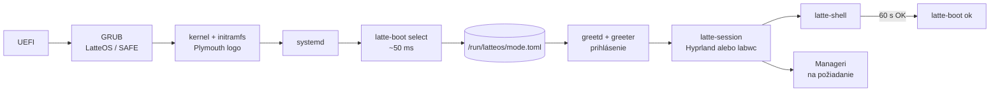
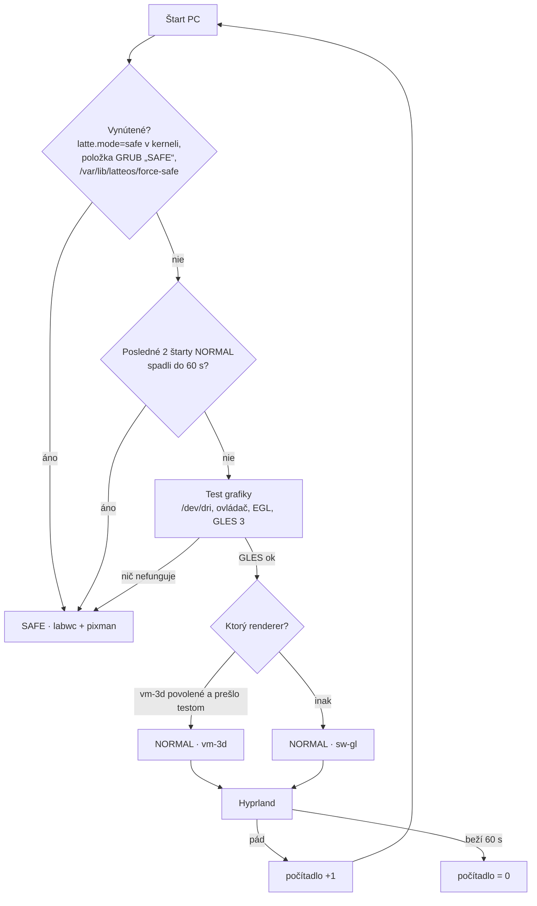

# LatteOS — roadmapa (nový štart)

23. 9. 2026 · @Arkay · návrh v0.1

Podklad: [technologický radar](inspo/LatteOS%20–%20technologický%20radar%202026.md),
prebraté zdroje v [resources/](resources/MANIFEST.md). Priečinok `old/` sa už **nemení**, slúži len na čítanie.

## Rámec

| | Teraz (fázy F0–F8) | Neskôr |
|---|---|---|
| Systém | **Fedora Server 44**, klasický (dnf) | Fedora Atomic (bootc / rpm-ostree), štýl Bazzite, **až keď bude všetko hotové** |
| Stroj | **VirtualBox VM** `latteOSdev`: VMSVGA, 128 MB VRAM, 3D zapnuté, 4 vCPU, 11 GB RAM | reálny PC s 3D grafikou **AMD aj NVIDIA** |
| Grafika | **softvérová** (llvmpipe / pixman), VMSVGA 3D len ako doplnková možnosť | plná HW akcelerácia, Vulkan |

**Pravidlo pre všetko, čo vznikne teraz:** musí to bežať vo VM bez GPU. HW akcelerácia môže
iba pridať efekty, nikdy nesmie byť podmienkou fungovania.

## Odpoveď: pobeží stack bez akcelerácie?

Stav hosťa (overené na `latteOSdev`): adaptér `VMware SVGA II [15ad:0405]`, ovládač `vmwgfx`,
schopnosti `3D, dx, SM_5`. Kernel pritom hlási *„vmwgfx seems to be running on an unsupported
hypervisor. This configuration is likely broken.“* 3D cesta VirtualBoxu je preto menej spoľahlivá
ako vo VMware a nesmieme na nej stavať.

Vo VM prichádzajú do úvahy tri grafické cesty:

- **A · sw-gl:** GL cez llvmpipe na CPU. 3D je vypnuté alebo sa ignoruje (`MESA_LOADER_DRIVER_OVERRIDE=kms_swrast`, pozri F0).
- **B · vm-3d:** Mesa ovládač `svga` nad VMSVGA 3D.
- **C · pixman:** čisté CPU kreslenie, žiadne GL.

| Komponent | A · sw-gl | B · vm-3d | C · pixman | Poznámka |
|---|---|---|---|---|
| **Hyprland 0.56** | ✅ overené | ⚠️ overené: patch + render voľby, artefakty | ❌ | Vyžaduje GLES 3 cez EGL/GBM a pixman renderer nemá. llvmpipe GLES 3.2 poskytuje. Pod B bez patchu padajú GPU klienti (čierna plocha). |
| labwc (wlroots) | ✅ overené | ❌ overené bez patchu | ✅ overené `WLR_RENDERER=pixman` | Jediný kompozitor zo zoznamu, ktorý beží **úplne bez GL**, preto je základom SAFE. |
| Quickshell / DMS / Caelestia | ✅ pomalšie | ⚠️ | ⚠️ len `QT_QUICK_BACKEND=software` | `ShaderEffect` (materiály tém) na llvmpipe beží, na Qt software backende nie. |
| xdph, hyprlock, matugen, portály | ✅ | ✅ | ✅ | nenáročné |
| Mission Center, cosmic-files | ✅ | ✅ | ✅ | GTK4/iced majú softvérovú cestu |
| Ollama | ✅ CPU | — | — | vo VM len malý model 3–4B; Qwen3-14B-sk (Q4 ~9 GB) sa nezmestí popri desktope |
| Steam, umu, Proton | ⚠️ launcher áno, hry prakticky nie | ⚠️ | ❌ | DXVK/vkd3d potrebujú Vulkan; lavapipe je len na smoke test |
| gamescope | ❌ | ❌ | ❌ | potrebuje skutočný Vulkan + DRM → **fáza HW** |
| Valve Lepton | ❌ | ❌ | ❌ | mountuje Mesa/zink z hostiteľa, cieľ je Steam Frame → **fáza HW** |

✅ = funguje, ⚠️ = s obmedzením, ❌ = nefunguje. Stĺpce „očakávané“ vychádzajú z dokumentácie a
hlásení používateľov. **Prvá úloha F1 je overiť celú tabuľku meraním na `latteOSdev`.**

**Záver:** Hyprland aj navrhované nástroje môžu bežať bez akcelerácie (cesta A). Na VMSVGA 3D
(cesta B) pobežia iba s patchom `vmwgfx-dmabuf`. Predvolená cesta vo VM bude A. Cestu B zapne
selektor iba vtedy, keď prejde test. SAFE režim stojí na ceste C.

## Režimy: NORMAL a SAFE

| | **NORMAL** | **SAFE** |
|---|---|---|
| Kompozitor | Hyprland (+ vmwgfx patch) + Lua modul LatteOS | labwc (balík Fedory) |
| Renderer | GLES: vm-3d → sw-gl podľa testu | **pixman** (nulová závislosť na GL/EGL/GPU) |
| Shell | plný LatteOS shell (Quickshell) | minimálny: foot + fuzzel + `latte-safe` ponuka; žiadne shadery, žiadna priehľadnosť |
| Efekty | podľa stupňa výkonu (vo VM tier **Softvér** = téma Úsporná) | žiadne |
| Účel | bežná práca | štart pri akomkoľvek probléme: rozbitý GPU stack, pád shellu, zlý update, chýbajúci ovládač |
| Ponuka `latte-safe` | — | diagnostika (log posledného pádu), „skúsiť NORMAL znova“, „vrátiť posledný update“, terminál, sieť |

SAFE musí naštartovať aj s parametrom kernelu `nomodeset`: labwc + pixman beží nad `simpledrm`.
Je to posledná záchrana, ktorá funguje s hocijakou grafikou.

### Štart systému: od zapnutia po shell

Tvoja predstava (BIOS → kernel → latte start → prihlásenie → shell) je správna, poradie tiež.
Upresnenia:

- „Latte start“ **nie je samostatná obrazovka ani prostredie.** Je to jedna krátka systemd služba
  (~50 ms), ktorá beží medzi ostatnými službami, kým je na obrazovke boot logo.
- Režim sa musí rozhodnúť **pred** obrazovkou prihlásenia, pretože aj tá je grafická a potrebuje
  kompozitor.
- Pod ňou je ešte jedna poistka: **GRUB**. Ak zlyhá už kernel, žiadna naša služba sa nespustí.

| # | Fáza | Čo beží | LatteOS časť | Čas na `latteOSdev` |
|---|---|---|---|---|
| 1 | Zapnutie | UEFI firmvér (BIOS), POST | — | mimo Linuxu |
| 2 | Bootloader | **GRUB**: položky „LatteOS“ a „LatteOS SAFE“ (`latte.mode=safe`); ponuka je skrytá, ukáže sa po neúspešnom štarte (Fedora `boot_success` flag) | GRUB téma, položka SAFE | — |
| 3 | Kernel + initramfs | ovládače (vmwgfx, neskôr amdgpu/nvidia), disk | **Plymouth** boot logo Latte (zakryje text a čiernu obrazovku) | 2,1 s + 5,2 s |
| 4 | systemd | desiatky služieb **paralelne** | — | 7,2 s spolu |
| 5 | **Latte start** | `latte-boot.service` (oneshot, `Before=greetd.service`): `latte-boot select` | detekcia HW/SW, výber režimu → `/run/latteos/mode.toml` | ~0,05 s (namerané: `/sys` 0 ms, EGL test 40 ms) |
| 6 | **Session Manager** | greetd → greeter vo vlastnom malom kompozitore podľa režimu | obrazovka prihlásenia (kandidát: Noctalia Greeter) | — |
| 7 | Relácia | po prihlásení `latte-session` prečíta `mode.toml` → Hyprland (NORMAL) alebo labwc (SAFE) cez systemd user (`latte-session.target`) | Lua modul, SAFE konfigurácia | — |
| 8 | **Shell** | `latte-shell.service`: **jeden** proces s lištou, Text Barom, panelmi a notifikáciami | shell | — |
| 9 | Manageri | Rust služby spúšťané **až na požiadanie** (D-Bus aktivácia), nie všetky pri štarte | Device, Process, Data, App, Session | — |
| 10 | Potvrdenie | po 60 s zdravej relácie `latte-boot ok`: vynuluje počítadlo pádov, nastaví GRUB `boot_success` | — | — |

### Jeden program, alebo viac malých?

**Pravidlo:** delí sa podľa toho, **kedy, s akými právami a ako dlho** kód beží. Nedelí sa podľa
funkcií. Čo beží spolu, s rovnakými právami a zdieľa dáta, patrí do jedného programu. Čo má inú
životnosť, iné práva alebo môže spadnúť nezávisle, patrí do samostatného programu.

| Program | Kedy / práva | Prečo samostatne |
|---|---|---|
| **`latte-boot`** (Rust, 1 binárka) | pri štarte, root, pár ms | jedna binárka s modulmi (`gpu`, `display`, `input`, `cmdline`, `crash`) a príkazmi `probe`, `select`, `ok`. **Nie** viac malých detektorov: zbytočné spúšťanie procesov a zložité poradie pre 50 ms práce |
| greeter | pred prihlásením, vlastný používateľ `greeter` | bezpečnosť: nevidí dáta používateľa |
| `latte-session` | po prihlásení, používateľ | spúšťa a stráži kompozitor; musí prežiť jeho pád |
| kompozitor | používateľ | cudzí projekt (Hyprland/labwc) |
| **shell** (1 proces) | používateľ, celá relácia | princíp „jeden mozog“ z radaru: jeden proces pre všetky panely, spoločný stav a téma |
| Manageri (každý zvlášť) | na požiadanie, časti cez polkit s root právami | pád Process Managera nesmie zhodiť shell; rôzne práva |

Detekčný kód z `latte-boot` je **knižnica** (Rust crate `latte-hw`). Device Manager ju neskôr
použije na plnú inventúru HW. Pomalé testy (Vulkan 180 ms, benchmark stupňa výkonu) nepatria do
štartu. Spustí ich Device Manager po prihlásení a výsledok uloží pre ďalší štart.

### Výber režimu — `latte-boot select`

Výsledok zapíše do `/run/latteos/mode.toml`. Ten súbor je jediné miesto pravdy: číta ho greeter,
`latte-session`, Hyprland Lua modul aj shell.

- **Počítadlo pádov:** rovnaký princíp ako `systemd-bless-boot`. `latte-session` zvýši počítadlo pri
  štarte kompozitora a `latte-boot ok` ho vynuluje po 60 s. Pád teda zaznamená niekto mimo toho,
  čo padá.
- **Test grafiky** (`latte-boot probe`): PCI ID a ovládač z `/sys`, EGL/GBM (renderer `llvmpipe`
  vs. `SVGA3D`), GLES 3.x. Výstupom je `renderer = vm-3d | sw-gl | none` a `tier`. Vulkan a stupne
  výkonu (Plný…Minimálny, NVIDIA 580/595) doplní Device Manager po prihlásení.
- **Ručná voľba:** v GRUB-e sú vždy dve položky, „LatteOS“ a „LatteOS SAFE“. V greeteri je voľba
  relácie (NORMAL/SAFE) pre toto prihlásenie.
- **Návrat:** zo SAFE ide jedným klikom „skúsiť NORMAL“ (vynuluje počítadlo). V NORMAL sa dá zapnúť
  „nabudúce SAFE“.

## Fázy

### F0 — Základ VM *(hotové 23. 9. 2026)*
- [x] Fedora 44 Server vo VirtualBoxe, VMSVGA s 3D.
- [x] Root LV rozšírený z 15 GB na celý disk (52 GB, `lvextend -r`), Fedora Server ho predvolene nechá malý.
- [x] Všetky balíky cez [setup/f0-install.sh](setup/f0-install.sh) (23. 9. 2026): Mesa 26.2.3, VirtualBox guest additions
  (`vboxservice` beží), COPR `lionheartp/Hyprland` (Hyprland 0.56.2, Quickshell 0.3.1, matugen 4.2), labwc 0.9.6,
  greetd a tuigreet, PipeWire, portály, písma, vývojové nástroje (C++, Rust, Go, rpm-build) a Ollama.
- [x] Snapshot VM „f0“ (čistý základ) vo VirtualBoxe.

**Namerané v F0** (bez spustenej relácie, `eglinfo -B -p gbm`, `vulkaninfo`):

| Cesta | Ako | EGL/GLES renderer |
|---|---|---|
| B · vm-3d | predvolené | `SVGA3D`, **iba GLES 3.0** |
| A · sw-gl | `MESA_LOADER_DRIVER_OVERRIDE=kms_swrast` | `llvmpipe`, **GLES 3.2** |
| Vulkan | predvolené | iba `llvmpipe` (lavapipe), žiadny HW Vulkan |

`LIBGL_ALWAYS_SOFTWARE=1` ani `GALLIUM_DRIVER=llvmpipe` na platforme GBM **nefungujú**, treba
`MESA_LOADER_DRIVER_OVERRIDE`. Cestu A bude pre Hyprland nastavovať `latte-boot select`.

### F1 — Grafický stack a režimy *(hotové 23. 9. 2026)*
- [x] Zmerať kompozitory (A/B/C) na `latteOSdev` → [setup/f1/RESULTS.md](setup/f1/RESULTS.md).
  SAFE (labwc+pixman) ✅, NORMAL swgl ✅ (pokoj 0 % CPU, animácia ~1,3 jadra), vm3d len experimentálne (artefakty).
- [x] Balík `hyprland-latte` 0.56.2-3.latte: [setup/f1/build-hyprland-latte.sh](setup/f1/build-hyprland-latte.sh), lokálne nainštalovaný.
- [x] vm3d: zaseknutie GL klientov rieši `render:commit_timing_enabled = false`; biele čiary okrajov ostávajú (kreslenie klienta cez SVGA3D) → vm3d ostáva vypnuté (`allow_vm3d = false`).
- [x] Noctalia v5 + Noctalia Greeter vo VM → [RESULTS.md](setup/f1/RESULTS.md#noctalia-v5-shell-a-noctalia-greeter): beží v NORMAL aj SAFE, lišta 0 % CPU.
- [x] Záťaž pri otvorenom paneli Noctalie spôsobila interakcia pri živom teste. Bez zásahu 5 % CPU.
- [x] DMS a Caelestia zmerané rovnakým testom → [porovnanie](setup/f1/RESULTS.md#porovnanie-shellov-noctalia-v5--dms--caelestia).
- [x] `latte-boot` (Rust, [crates/](crates/)): `probe`, `select`, `session-start`, `ok`, `reset`, `force-safe`, `status` → `/run/latteos/{mode.toml,session.env,hyprland.conf}`; výber ~85 ms, 12 testov.
- [x] Nastavenia pre VM: `latte-boot` generuje `/run/latteos/hyprland.conf` (bez HW kurzora, stupeň Softvér bez efektov; pri vm-3d `commit_timing_enabled = false`). V Lua ich prepíše F2.
- [x] `latte-boot.service` pred greetd, počítadlo pádov (limit 2, zdravá relácia po 60 s), GRUB položky „LatteOS SAFE“ a „LatteOS SAFE — bez ovládača grafiky“ (kernel-install plugin), Plymouth téma Latte.
- [x] `latte-session`: podľa `session.env` spustí Hyprland (NORMAL) alebo labwc (SAFE). Pád Hyprlandu do 60 s → SAFE hneď v tom istom prihlásení. Strážcom je `latte-session`, nie `start-hyprland` (ten po páde reštartuje bez `-c`).
- [x] SAFE relácia: labwc + pixman + Noctalia + ponuka `latte-safe` (diagnostika, skúsiť NORMAL, sieť, rollback dnf). Boot s `nomodeset` naštartoval (simpledrm); grafická relácia nad simpledrm ešte neoverená.
- [x] Greeter: greetd + **tuigreet** (textový, bez GPU), ponúka iba „LatteOS“ a „LatteOS SAFE“. Noctalia Greeter je vypnutý (`greeter = "tui"`): pod greetd prepúšťa pamäť jadra ~36 MB/s.
- [x] **Celý štart overený 23. 9. 2026:** Plymouth → `latte-boot` (NORMAL · sw-gl) → tuigreet → LatteOS (Hyprland + Noctalia) → `latte-boot ok` po 60 s. Boot 13,4 s.
- [ ] Presunuté ďalej: vlastný COPR `latteos` (treba FAS účet a API token; zatiaľ lokálny repozitár `latteos-local`, COPR má `excludepkgs=hyprland*`).
- [ ] Presunuté ďalej: Noctalia Greeter bez úniku pamäte (F3), grafická SAFE relácia s `nomodeset`, systemd user integrácia relácie (`latte-session.target`).

### F2 — Hyprland Lua modul LatteOS *(základ hotový 23. 9. 2026)*
- [x] `session/hypr/hyprland.lua` + `latte/{mode,tiers,windows}.lua`: načíta `/run/latteos/mode.toml`
  (renderer, stupeň); stupeň sa dá vynútiť v `~/.config/latteos/tier`.
- [x] Stupne **Plný / Štandard / Úsporný / Minimálny / Softvér**: blur, tiene, žiara aktívneho okna
  (`decoration.glow`, 0.56), animácie. Vo VM beží Softvér (bez efektov).
- [x] Režimy okien: **nekonečná páska** (scrolling, stĺpec 1/2 obrazovky), **dlaždice** (dwindle),
  **plávajúce** (pravidlo `float` + uvoľnenie existujúcich okien). Super+W prepína, voľba sa pamätá
  (`~/.local/state/latteos/window-mode`). Overené naostro.
- [x] Skratky: Super+Enter terminál, Super+Space spúšťač, Super+Tab prehľad, Super+A riadiace centrum,
  Super+E súbory, Super+D plocha, Super+Q/F/V, Super+šípky fokus, Super+Ctrl+šípky presun v páske,
  Super+Shift+šípky okno na iný monitor, Super+1–9 plochy. Gesto 3 prsty = plochy.
- [x] Vzhľad Latte: karamelový gradient okraja, rohy 14 px, mierka 1 (auto vo VM dávalo 2).
- [x] Vlastné úpravy používateľa: `~/.config/latteos/hyprland.lua` (pcall, chyba sa ukáže ako notifikácia).
- [ ] Prehľad pásky ako vlastný panel (návrh: celá páska v jednom rade, filtrovanie písaním).
- [ ] Ťahanie okna k okraju: pri páske posun pásky, pri dlaždiciach ponuka rozložení (Windows 11).
- [ ] Gesto 4 prsty = prehľad; tapeta podľa plochy; herný režim (vypnúť efekty počas hry).

### F3 — Shell
- [x] Porovnať **troch kandidátov** vo VM (cesta A a SAFE): RAM, CPU v pokoji, plynulosť, čas štartu. Rozhodnúť a forknúť.

  | Kandidát | Technológia | Licencia | Silné stránky | Riziká |
  |---|---|---|---|---|
  | [DankMaterialShell](https://github.com/AvengeMedia/DankMaterialShell) | Quickshell (QML) + Go | MIT | zrelý, Fedora RPM, lock súbor pluginov | Qt v pamäti, `ShaderEffect` na llvmpipe |
  | [Caelestia](https://github.com/caelestia-dots/shell) | Quickshell (QML) | GPL-3.0 | princíp „jeden mozog“ | GPL pri forku |
  | **[Noctalia v5](https://github.com/noctalia-dev/noctalia-shell)** | C++, vlastné kreslenie OpenGL ES, **bez Qt/GTK** | MIT | lišta, dock, launcher, riadiace centrum, notifikácie, OSD, lock screen, schránka, widgety; farby z tapety; TOML s hot reloadom; 138 pluginov ([noctalia-plugins](https://github.com/noctalia-dev/noctalia-plugins)); backendy pre Hyprland aj **labwc** (jeden shell pre NORMAL aj SAFE); vlastný [greeter](https://github.com/noctalia-dev/noctalia-greeter) v rovnakom štýle | **alfa** (5.1.0), konfigurácia sa ešte mení; bez Qt treba vlastné UI prvky |

  **Skóre po meraní 23. 9. 2026** (1–5, vo VM):

  | Kritérium | Váha | Noctalia v5 | DMS | Caelestia |
  |---|---|---|---|---|
  | Všetko pod jednou strechou (vrátane greetera) | 3 | 5 | 4 | 4 |
  | Zrelosť / stabilita | 2 | **2** (alfa) | 4 | 4 |
  | Výkon vo VM (CPU, RAM) | 2 | 5 | 3 | 2 |
  | SAFE režim (labwc) | 2 | 5 | 5 | 2 |
  | Licencia pre fork (MIT/BSD vs GPL) | 1 | 5 | 5 | 2 |
  | Technologický smer (bez Qt, jeden proces) | 1 | 5 | 3 | 3 |
  | **Vážený súčet (max 55)** | | **48** | 43 | 34 |

  **Rozhodnuté 23. 9. 2026: shell LatteOS stavia na Noctalii v5** (fork, MIT). DMS ostáva ako záloha.
  **Caelestia je zdroj prvkov** pre silnejšie PC (stupeň Plný): dashboard, vizualizér, výkonové
  krúžky, animácie ako bongocat, morfujúce panely. Prvky sa prepíšu do Noctalie (C++/GLES) a
  zapínajú sa iba pri stupni Plný/Štandard. Kód sa nekopíruje, pretože Caelestia je GPL-3.0.
  Oficiálne repozitáre pluginov Caelestie sú zatiaľ prázdne; bohatý je samotný shell.

  **Pôvodne prednostná voľba: Noctalia v5.** Alfa stav jej znižuje skóre a to by mohla dobehnúť Caelestia.
  Merania však ukázali, že Caelestia vo VM zaostáva: animovaný dashboard pod Hyprlandom zaberie
  ~2 jadrá, pod labwc nefungujú panely, berie ~600 MB a má licenciu GPL. Náhradná voľba je preto
  **DMS**, ak by alfa Noctalie spôsobovala problémy.

  Radar dal Noctalii v5 verdikt „Sledovať“ kvôli alfa stavu. Pre LatteOS je však najbližšie
  k cieľu: natívny shell bez Qt, jeden vzhľad od prihlásenia po plochu a podpora labwc.
  Preto je v porovnaní ako rovnocenný kandidát. Balíky sú v COPR `lionheartp/Hyprland`
  (`noctalia-git` 5.1.0, `noctalia-greeter-git`). **Prvý test 23. 9. 2026:** beží v NORMAL aj SAFE, pozri F1.
- [ ] Spodná lišta z ostrovov: App Manager, čas a notifikácie, Latte a páska, Text Bar, kapsa, súbory a zariadenia.
- [ ] Prehľad pásky (Super+Tab) nad IPC Hyprlandu.
- [ ] Fork Noctalie v5 (`latte-shell`), vlastný repozitár.
- [ ] Téma **Latte** a **Úsporná**, farby z tapety (Noctalia má vlastný generátor, matugen ako záloha).
- [ ] Prvky pre stupeň Plný podľa Caelestie: dashboard s výkonom, vizualizér, animované widgety.
- [ ] Každý prvok shellu musí mať variant bez shaderov.

### F4 — Systémové služby (Rust)
- [ ] Device Manager: stavia na crate `latte-hw`, udisks2, NetworkManager, PipeWire.
- [ ] Process Manager: náhrada Ctrl+Alt+Del, autoruns, HW info (vzor Mission Center).
- [ ] Data Manager: pohľad „Tento počítač“ z udisks2, dva panely (vzor cosmic-files).
- [ ] App Manager: dnf + Flatpak (neskôr rpm-ostree), jednotné IPC so shellom.

### F5 — Stabilita a pamäť
- [ ] Port `resources/upstream/ubuntu-settings/oom/` do Fedory: premapovať GNOME služby na LatteOS
  (Hyprland, shell, PipeWire, portály, dbus-broker) a nastaviť `ManagedOOMMemoryPressure=auto` pre `user@.service`.
- [ ] Profil „hra má prednosť“ (zatiaľ len konfigurácia).
- [ ] Test: zaplniť RAM vo VM, relácia musí prežiť.

### F6 — Bezpečnostný model *(hlavný diferenciátor)*
- [ ] Trusted/untrusted profily nad Flatpak portálmi a bubblewrapom.
- [ ] Tlačidlo NET na aplikáciu, zatiaľ pre natívne a Flatpak aplikácie.
- [ ] Setup Plan dialóg (vzor Flatseal).

### F7 — AI a Text Bar
- [ ] Ollama na CPU s malým modelom (3–4B). Router lokálne/online.
- [ ] Text Bar: 4 režimy (Lokálne, Web, AI, Linux príkaz) a potvrdenie deštruktívnych príkazov.

### F8 — Herná vrstva (len integrácia, bez výkonu)
- [ ] Steam, umu-launcher, Proton 11: inštalácia, spustenie launchera, integrácia do App Managera.
- [ ] Prepínač „Desktop ↔ Hra“ ako UI, zatiaľ bez gamescope.

### H — Reálny hardvér *(keď bude pripravený PC s AMD aj NVIDIA)*
- [ ] `latte-hw` rozšíriť o stupne Plný / Štandard / Úsporný / Minimálny.
- [ ] NVIDIA: RPM Fusion `akmod-nvidia` (595+) a `akmod-nvidia-580xx` pre GTX 900/10xx. Nikdy nemeniť vetvu ovládača bez overenia.
- [ ] AMD: Mesa RADV.
- [ ] gamescope herná relácia, MangoHud, HDR/VRR.
- [ ] Lepton (Android hry), Qwen3-14B-sk.
- [ ] SAFE režim ostáva ako záchrana, napríklad pri zlom ovládači NVIDIA.

### A — Fedora Atomic *(až keď bude F0–F8 + H hotové)*
- [ ] Obraz LatteOS cez bootc / rpm-ostree podľa vzoru Bazzite (`resources/upstream/bazzite`).
- [ ] „Vrátiť včerajší systém“ v App Manageri. SAFE ponuka dostane rollback rpm-ostree.

## Otvorené otázky
- DMS alebo Caelestia ako základ shellu. Rozhodne meranie v F3.
- Vydrží llvmpipe na 4 vCPU plynulé animácie shellu pri 1080p? Ak nie, tier Softvér vypne animácie úplne.
- Vlastný COPR `latteos`, alebo lokálne RPM repo počas vývoja?
