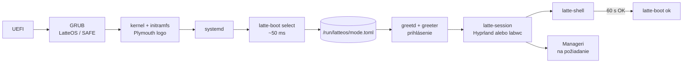
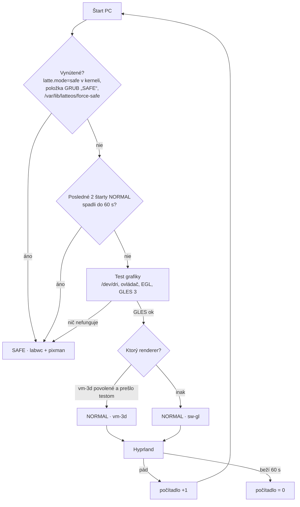

# LatteOS — roadmapa (nový štart)

23. 9. 2026 · @Arkay · návrh v0.1

Podklad: [technologický radar](inspo/LatteOS%20–%20technologický%20radar%202026.md),
prebraté zdroje v [resources/](resources/MANIFEST.md). Priečinok `old/` sa už **nemení**, slúži len na čítanie.

## Rámec

| | Teraz (fázy F0–F8) | Neskôr |
|---|---|---|
| Systém | **Fedora Server 44**, klasický (dnf) | Fedora Atomic (bootc / rpm-ostree), štýl Bazzite, **až keď bude všetko hotové** |
| Stroj | **VirtualBox VM** `latteOSdev`: VMSVGA, 128 MB VRAM, 3D zapnuté, 4 vCPU, 11 GB RAM | reálny PC s 3D grafikou **AMD aj NVIDIA** |
| Grafika | **softvérová** (llvmpipe / pixman), VMSVGA 3D len ako doplnková možnosť | plná HW akcelerácia, Vulkan |

**Pravidlo pre všetko, čo vznikne teraz:** musí to bežať vo VM bez GPU. HW akcelerácia môže
iba pridať efekty, nikdy nesmie byť podmienkou fungovania.

## Odpoveď: pobeží stack bez akcelerácie?

Stav hosťa (overené na `latteOSdev`): adaptér `VMware SVGA II [15ad:0405]`, ovládač `vmwgfx`,
schopnosti `3D, dx, SM_5`. Kernel pritom hlási *„vmwgfx seems to be running on an unsupported
hypervisor. This configuration is likely broken.“* 3D cesta VirtualBoxu je preto menej spoľahlivá
ako vo VMware a nesmieme na nej stavať.

Vo VM prichádzajú do úvahy tri grafické cesty:

- **A · sw-gl:** GL cez llvmpipe na CPU. 3D je vypnuté alebo sa ignoruje (`MESA_LOADER_DRIVER_OVERRIDE=kms_swrast`, pozri F0).
- **B · vm-3d:** Mesa ovládač `svga` nad VMSVGA 3D.
- **C · pixman:** čisté CPU kreslenie, žiadne GL.

| Komponent | A · sw-gl | B · vm-3d | C · pixman | Poznámka |
|---|---|---|---|---|
| **Hyprland 0.56** | ✅ overené | ⚠️ overené: patch + render voľby, artefakty | ❌ | Vyžaduje GLES 3 cez EGL/GBM a pixman renderer nemá. llvmpipe GLES 3.2 poskytuje. Pod B bez patchu padajú GPU klienti (čierna plocha). |
| labwc (wlroots) | ✅ overené | ❌ overené bez patchu | ✅ overené `WLR_RENDERER=pixman` | Jediný kompozitor zo zoznamu, ktorý beží **úplne bez GL**, preto je základom SAFE. |
| Quickshell / DMS / Caelestia | ✅ pomalšie | ⚠️ | ⚠️ len `QT_QUICK_BACKEND=software` | `ShaderEffect` (materiály tém) na llvmpipe beží, na Qt software backende nie. |
| xdph, hyprlock, matugen, portály | ✅ | ✅ | ✅ | nenáročné |
| Mission Center, cosmic-files | ✅ | ✅ | ✅ | GTK4/iced majú softvérovú cestu |
| Ollama | ✅ CPU | — | — | vo VM len malý model 3–4B; Qwen3-14B-sk (Q4 ~9 GB) sa nezmestí popri desktope |
| Steam, umu, Proton | ⚠️ launcher áno, hry prakticky nie | ⚠️ | ❌ | DXVK/vkd3d potrebujú Vulkan; lavapipe je len na smoke test |
| gamescope | ❌ | ❌ | ❌ | potrebuje skutočný Vulkan + DRM → **fáza HW** |
| Valve Lepton | ❌ | ❌ | ❌ | mountuje Mesa/zink z hostiteľa, cieľ je Steam Frame → **fáza HW** |

✅ = funguje, ⚠️ = s obmedzením, ❌ = nefunguje. Stĺpce „očakávané“ vychádzajú z dokumentácie a
hlásení používateľov. **Prvá úloha F1 je overiť celú tabuľku meraním na `latteOSdev`.**

**Záver:** Hyprland aj navrhované nástroje môžu bežať bez akcelerácie (cesta A). Na VMSVGA 3D
(cesta B) pobežia iba s patchom `vmwgfx-dmabuf`. Predvolená cesta vo VM bude A. Cestu B zapne
selektor iba vtedy, keď prejde test. SAFE režim stojí na ceste C.

## Režimy: NORMAL a SAFE

| | **NORMAL** | **SAFE** |
|---|---|---|
| Kompozitor | Hyprland (+ vmwgfx patch) + Lua modul LatteOS | labwc (balík Fedory) |
| Renderer | GLES: vm-3d → sw-gl podľa testu | **pixman** (nulová závislosť na GL/EGL/GPU) |
| Shell | plný LatteOS shell (Quickshell) | minimálny: foot + fuzzel + `latte-safe` ponuka; žiadne shadery, žiadna priehľadnosť |
| Efekty | podľa stupňa výkonu (vo VM tier **Softvér** = téma Úsporná) | žiadne |
| Účel | bežná práca | štart pri akomkoľvek probléme: rozbitý GPU stack, pád shellu, zlý update, chýbajúci ovládač |
| Ponuka `latte-safe` | — | diagnostika (log posledného pádu), „skúsiť NORMAL znova“, „vrátiť posledný update“, terminál, sieť |

SAFE musí naštartovať aj s parametrom kernelu `nomodeset`: labwc + pixman beží nad `simpledrm`.
Je to posledná záchrana, ktorá funguje s hocijakou grafikou.

### Štart systému: od zapnutia po shell

Tvoja predstava (BIOS → kernel → latte start → prihlásenie → shell) je správna, poradie tiež.
Upresnenia:

- „Latte start“ **nie je samostatná obrazovka ani prostredie.** Je to jedna krátka systemd služba
  (~50 ms), ktorá beží medzi ostatnými službami, kým je na obrazovke boot logo.
- Režim sa musí rozhodnúť **pred** obrazovkou prihlásenia, pretože aj tá je grafická a potrebuje
  kompozitor.
- Pod ňou je ešte jedna poistka: **GRUB**. Ak zlyhá už kernel, žiadna naša služba sa nespustí.

| # | Fáza | Čo beží | LatteOS časť | Čas na `latteOSdev` |
|---|---|---|---|---|
| 1 | Zapnutie | UEFI firmvér (BIOS), POST | — | mimo Linuxu |
| 2 | Bootloader | **GRUB**: položky „LatteOS“ a „LatteOS SAFE“ (`latte.mode=safe`); ponuka je skrytá, ukáže sa po neúspešnom štarte (Fedora `boot_success` flag) | GRUB téma, položka SAFE | — |
| 3 | Kernel + initramfs | ovládače (vmwgfx, neskôr amdgpu/nvidia), disk | **Plymouth** boot logo Latte (zakryje text a čiernu obrazovku) | 2,1 s + 5,2 s |
| 4 | systemd | desiatky služieb **paralelne** | — | 7,2 s spolu |
| 5 | **Latte start** | `latte-boot.service` (oneshot, `Before=greetd.service`): `latte-boot select` | detekcia HW/SW, výber režimu → `/run/latteos/mode.toml` | ~0,05 s (namerané: `/sys` 0 ms, EGL test 40 ms) |
| 6 | **Session Manager** | greetd → greeter vo vlastnom malom kompozitore podľa režimu | obrazovka prihlásenia (kandidát: Noctalia Greeter) | — |
| 7 | Relácia | po prihlásení `latte-session` prečíta `mode.toml` → Hyprland (NORMAL) alebo labwc (SAFE) cez systemd user (`latte-session.target`) | Lua modul, SAFE konfigurácia | — |
| 8 | **Shell** | `latte-shell.service`: **jeden** proces s lištou, Text Barom, panelmi a notifikáciami | shell | — |
| 9 | Manageri | Rust služby spúšťané **až na požiadanie** (D-Bus aktivácia), nie všetky pri štarte | Device, Process, Data, App, Session | — |
| 10 | Potvrdenie | po 60 s zdravej relácie `latte-boot ok`: vynuluje počítadlo pádov, nastaví GRUB `boot_success` | — | — |

### Jeden program, alebo viac malých?

**Pravidlo:** delí sa podľa toho, **kedy, s akými právami a ako dlho** kód beží. Nedelí sa podľa
funkcií. Čo beží spolu, s rovnakými právami a zdieľa dáta, patrí do jedného programu. Čo má inú
životnosť, iné práva alebo môže spadnúť nezávisle, patrí do samostatného programu.

| Program | Kedy / práva | Prečo samostatne |
|---|---|---|
| **`latte-boot`** (Rust, 1 binárka) | pri štarte, root, pár ms | jedna binárka s modulmi (`gpu`, `display`, `input`, `cmdline`, `crash`) a príkazmi `probe`, `select`, `ok`. **Nie** viac malých detektorov: zbytočné spúšťanie procesov a zložité poradie pre 50 ms práce |
| greeter | pred prihlásením, vlastný používateľ `greeter` | bezpečnosť: nevidí dáta používateľa |
| `latte-session` | po prihlásení, používateľ | spúšťa a stráži kompozitor; musí prežiť jeho pád |
| kompozitor | používateľ | cudzí projekt (Hyprland/labwc) |
| **shell** (1 proces) | používateľ, celá relácia | princíp „jeden mozog“ z radaru: jeden proces pre všetky panely, spoločný stav a téma |
| Manageri (každý zvlášť) | na požiadanie, časti cez polkit s root právami | pád Process Managera nesmie zhodiť shell; rôzne práva |

Detekčný kód z `latte-boot` je **knižnica** (Rust crate `latte-hw`). Device Manager ju neskôr
použije na plnú inventúru HW. Pomalé testy (Vulkan 180 ms, benchmark stupňa výkonu) nepatria do
štartu. Spustí ich Device Manager po prihlásení a výsledok uloží pre ďalší štart.

### Výber režimu — `latte-boot select`

Výsledok zapíše do `/run/latteos/mode.toml`. Ten súbor je jediné miesto pravdy: číta ho greeter,
`latte-session`, Hyprland Lua modul aj shell.

- **Počítadlo pádov:** rovnaký princíp ako `systemd-bless-boot`. `latte-session` zvýši počítadlo pri
  štarte kompozitora a `latte-boot ok` ho vynuluje po 60 s. Pád teda zaznamená niekto mimo toho,
  čo padá.
- **Test grafiky** (`latte-boot probe`): PCI ID a ovládač z `/sys`, EGL/GBM (renderer `llvmpipe`
  vs. `SVGA3D`), GLES 3.x. Výstupom je `renderer = vm-3d | sw-gl | none` a `tier`. Vulkan a stupne
  výkonu (Plný…Minimálny, NVIDIA 580/595) doplní Device Manager po prihlásení.
- **Ručná voľba:** v GRUB-e sú vždy dve položky, „LatteOS“ a „LatteOS SAFE“. V greeteri je voľba
  relácie (NORMAL/SAFE) pre toto prihlásenie.
- **Návrat:** zo SAFE ide jedným klikom „skúsiť NORMAL“ (vynuluje počítadlo). V NORMAL sa dá zapnúť
  „nabudúce SAFE“.

## Fázy

### F0 — Základ VM *(hotové 23. 9. 2026)*
- [x] Fedora 44 Server vo VirtualBoxe, VMSVGA s 3D.
- [x] Root LV rozšírený z 15 GB na celý disk (52 GB, `lvextend -r`), Fedora Server ho predvolene nechá malý.
- [x] Všetky balíky cez [setup/f0-install.sh](setup/f0-install.sh) (23. 9. 2026): Mesa 26.2.3, VirtualBox guest additions
  (`vboxservice` beží), COPR `lionheartp/Hyprland` (Hyprland 0.56.2, Quickshell 0.3.1, matugen 4.2), labwc 0.9.6,
  greetd a tuigreet, PipeWire, portály, písma, vývojové nástroje (C++, Rust, Go, rpm-build) a Ollama.
- [x] Snapshot VM „f0“ (čistý základ) vo VirtualBoxe.

**Namerané v F0** (bez spustenej relácie, `eglinfo -B -p gbm`, `vulkaninfo`):

| Cesta | Ako | EGL/GLES renderer |
|---|---|---|
| B · vm-3d | predvolené | `SVGA3D`, **iba GLES 3.0** |
| A · sw-gl | `MESA_LOADER_DRIVER_OVERRIDE=kms_swrast` | `llvmpipe`, **GLES 3.2** |
| Vulkan | predvolené | iba `llvmpipe` (lavapipe), žiadny HW Vulkan |

`LIBGL_ALWAYS_SOFTWARE=1` ani `GALLIUM_DRIVER=llvmpipe` na platforme GBM **nefungujú**, treba
`MESA_LOADER_DRIVER_OVERRIDE`. Cestu A bude pre Hyprland nastavovať `latte-boot select`.

### F1 — Grafický stack a režimy *(hotové 23. 9. 2026)*
- [x] Zmerať kompozitory (A/B/C) na `latteOSdev` → [setup/f1/RESULTS.md](setup/f1/RESULTS.md).
  SAFE (labwc+pixman) ✅, NORMAL swgl ✅ (pokoj 0 % CPU, animácia ~1,3 jadra), vm3d len experimentálne (artefakty).
- [x] Balík `hyprland-latte` 0.56.2-3.latte: [setup/f1/build-hyprland-latte.sh](setup/f1/build-hyprland-latte.sh), lokálne nainštalovaný.
- [x] vm3d: zaseknutie GL klientov rieši `render:commit_timing_enabled = false`; biele čiary okrajov ostávajú (kreslenie klienta cez SVGA3D) → vm3d ostáva vypnuté (`allow_vm3d = false`).
- [x] Noctalia v5 + Noctalia Greeter vo VM → [RESULTS.md](setup/f1/RESULTS.md#noctalia-v5-shell-a-noctalia-greeter): beží v NORMAL aj SAFE, lišta 0 % CPU.
- [x] Záťaž pri otvorenom paneli Noctalie spôsobila interakcia pri živom teste. Bez zásahu 5 % CPU.
- [x] DMS a Caelestia zmerané rovnakým testom → [porovnanie](setup/f1/RESULTS.md#porovnanie-shellov-noctalia-v5--dms--caelestia).
- [x] `latte-boot` (Rust, [crates/](crates/)): `probe`, `select`, `session-start`, `ok`, `reset`, `force-safe`, `status` → `/run/latteos/{mode.toml,session.env,hyprland.conf}`; výber ~85 ms, 12 testov.
- [x] Nastavenia pre VM: `latte-boot` generuje `/run/latteos/hyprland.conf` (bez HW kurzora, stupeň Softvér bez efektov; pri vm-3d `commit_timing_enabled = false`). V Lua ich prepíše F2.
- [x] `latte-boot.service` pred greetd, počítadlo pádov (limit 2, zdravá relácia po 60 s), GRUB položky „LatteOS SAFE“ a „LatteOS SAFE — bez ovládača grafiky“ (kernel-install plugin), Plymouth téma Latte.
- [x] `latte-session`: podľa `session.env` spustí Hyprland (NORMAL) alebo labwc (SAFE). Pád Hyprlandu do 60 s → SAFE hneď v tom istom prihlásení. Strážcom je `latte-session`, nie `start-hyprland` (ten po páde reštartuje bez `-c`).
- [x] SAFE relácia: labwc + pixman + Noctalia + ponuka `latte-safe` (diagnostika, skúsiť NORMAL, sieť, rollback dnf). Boot s `nomodeset` naštartoval (simpledrm); grafická relácia nad simpledrm ešte neoverená.
- [x] Greeter: greetd + **tuigreet** (textový, bez GPU), ponúka iba „LatteOS“ a „LatteOS SAFE“. Noctalia Greeter je vypnutý (`greeter = "tui"`): pod greetd prepúšťa pamäť jadra ~36 MB/s.
- [x] **Celý štart overený 23. 9. 2026:** Plymouth → `latte-boot` (NORMAL · sw-gl) → tuigreet → LatteOS (Hyprland + Noctalia) → `latte-boot ok` po 60 s. Boot 13,4 s.
- [ ] Presunuté ďalej: distribúcia balíkov pre iné PC. **Rozhodnuté 24. 9. 2026:** čaká sa na HW testovací stroj a Atomic (bootc); dovtedy lokálny repozitár `latteos-local`, COPR má `excludepkgs=hyprland*`.
- [ ] Presunuté ďalej: Noctalia Greeter bez úniku pamäte (F3), grafická SAFE relácia s `nomodeset`, systemd user integrácia relácie (`latte-session.target` ✅ 24. 9.).

### F2 — Hyprland Lua modul LatteOS *(základ hotový 23. 9. 2026)*
- [x] `session/hypr/hyprland.lua` + `latte/{mode,tiers,windows}.lua`: načíta `/run/latteos/mode.toml`
  (renderer, stupeň); stupeň sa dá vynútiť v `~/.config/latteos/tier`.
- [x] Stupne **Plný / Štandard / Úsporný / Minimálny / Softvér**: blur, tiene, žiara aktívneho okna
  (`decoration.glow`, 0.56), animácie. Vo VM beží Softvér (bez efektov).
- [x] Režimy okien: **nekonečná páska** (scrolling, stĺpec 1/2 obrazovky), **dlaždice** (dwindle),
  **plávajúce** (pravidlo `float` + uvoľnenie existujúcich okien). Super+W prepína, voľba sa pamätá
  (`~/.local/state/latteos/window-mode`). Overené naostro.
- [x] Skratky: Super+Enter terminál, Super+Space spúšťač, Super+Tab prehľad, Super+A riadiace centrum,
  Super+E súbory, Super+D plocha, Super+Q/F/V, Super+šípky fokus, Super+Ctrl+šípky presun v páske,
  Super+Shift+šípky okno na iný monitor, Super+1–9 plochy. Gesto 3 prsty = plochy.
- [x] Vzhľad Latte: karamelový gradient okraja, rohy 14 px, mierka 1 (auto vo VM dávalo 2).
- [x] Vlastné úpravy používateľa: `~/.config/latteos/hyprland.lua` (pcall, chyba sa ukáže ako notifikácia).
- [x] Prehľad pásky ako vlastný panel (plugin latteos/overview, Super+Tab, filtrovanie písaním).
- [x] **Rozloženie okna** (Super+Z, ako Win+Z): mini obrazovky pre polovice, štvrtiny, tretiny, stred, celú plochu
  (`latte/snap.lua`, rešpektuje lištu). Overené na živej relácii.
- [x] **Jednotné okenné tlačidlá** (hyprbars, `latte/bars.lua`): – □ ✕ v titulku okien bez vlastnej hlavičky, farby z palety;
  CSD aplikácie bez druhého pruhu; minimalizovať = `special:minimized` (Super+N / Super+Shift+N); aplikácie LatteOS rovnaké tlačidlá, NET iba pri spojení.
- [x] NET pre cudzie okná (`latte-app netznak`, `latte-net used PID`): znak v titulku / jazýček nad CSD oknom, iba po spojení von.
- [x] GTK/Firefox – □ ✕ (`button-layout`), `latte-session.target` → graphical-session.target → portály bežia.
- [x] Ťahanie okna k okraju s ponukou rozložení ako Windows 11 (26. 9.): plugin `latte-okna` posiela udalosti ťahania,
  `latte/prichytenie.lua` prichytí okno (hore, boky, rohy, lišta rozložení), náhľad cieľa v `nahlad.qml`.
- [x] Profily ovládania Windows / Linux / macOS (`latte/skratky.lua`, alfatest 1), ponuky Ctrl+Alt+Del, Win+X, Win+P a ponuka okna.
- [x] Gesto 4 prsty hore = prehľad pásky, dole = prázdna plocha; tapeta podľa plochy (voliteľné, Nastavenia › Pozadie);
  herný režim (`latte.game`).

### F3 — Shell
- [x] Porovnať **troch kandidátov** vo VM (cesta A a SAFE): RAM, CPU v pokoji, plynulosť, čas štartu. Rozhodnúť a forknúť.

  | Kandidát | Technológia | Licencia | Silné stránky | Riziká |
  |---|---|---|---|---|
  | [DankMaterialShell](https://github.com/AvengeMedia/DankMaterialShell) | Quickshell (QML) + Go | MIT | zrelý, Fedora RPM, lock súbor pluginov | Qt v pamäti, `ShaderEffect` na llvmpipe |
  | [Caelestia](https://github.com/caelestia-dots/shell) | Quickshell (QML) | GPL-3.0 | princíp „jeden mozog“ | GPL pri forku |
  | **[Noctalia v5](https://github.com/noctalia-dev/noctalia-shell)** | C++, vlastné kreslenie OpenGL ES, **bez Qt/GTK** | MIT | lišta, dock, launcher, riadiace centrum, notifikácie, OSD, lock screen, schránka, widgety; farby z tapety; TOML s hot reloadom; 138 pluginov ([noctalia-plugins](https://github.com/noctalia-dev/noctalia-plugins)); backendy pre Hyprland aj **labwc** (jeden shell pre NORMAL aj SAFE); vlastný [greeter](https://github.com/noctalia-dev/noctalia-greeter) v rovnakom štýle | **alfa** (5.1.0), konfigurácia sa ešte mení; bez Qt treba vlastné UI prvky |

  **Skóre po meraní 23. 9. 2026** (1–5, vo VM):

  | Kritérium | Váha | Noctalia v5 | DMS | Caelestia |
  |---|---|---|---|---|
  | Všetko pod jednou strechou (vrátane greetera) | 3 | 5 | 4 | 4 |
  | Zrelosť / stabilita | 2 | **2** (alfa) | 4 | 4 |
  | Výkon vo VM (CPU, RAM) | 2 | 5 | 3 | 2 |
  | SAFE režim (labwc) | 2 | 5 | 5 | 2 |
  | Licencia pre fork (MIT/BSD vs GPL) | 1 | 5 | 5 | 2 |
  | Technologický smer (bez Qt, jeden proces) | 1 | 5 | 3 | 3 |
  | **Vážený súčet (max 55)** | | **48** | 43 | 34 |

  **Rozhodnuté 23. 9. 2026: shell LatteOS stavia na Noctalii v5** (fork, MIT). DMS ostáva ako záloha.
  **Caelestia je zdroj prvkov** pre silnejšie PC (stupeň Plný): dashboard, vizualizér, výkonové
  krúžky, animácie ako bongocat, morfujúce panely. Prvky sa prepíšu do Noctalie (C++/GLES) a
  zapínajú sa iba pri stupni Plný/Štandard. Kód sa nekopíruje, pretože Caelestia je GPL-3.0.
  Oficiálne repozitáre pluginov Caelestie sú zatiaľ prázdne; bohatý je samotný shell.

  **Pôvodne prednostná voľba: Noctalia v5.** Alfa stav jej znižuje skóre a to by mohla dobehnúť Caelestia.
  Merania však ukázali, že Caelestia vo VM zaostáva: animovaný dashboard pod Hyprlandom zaberie
  ~2 jadrá, pod labwc nefungujú panely, berie ~600 MB a má licenciu GPL. Náhradná voľba je preto
  **DMS**, ak by alfa Noctalie spôsobovala problémy.

  Radar dal Noctalii v5 verdikt „Sledovať“ kvôli alfa stavu. Pre LatteOS je však najbližšie
  k cieľu: natívny shell bez Qt, jeden vzhľad od prihlásenia po plochu a podpora labwc.
  Preto je v porovnaní ako rovnocenný kandidát. Balíky sú v COPR `lionheartp/Hyprland`
  (`noctalia-git` 5.1.0, `noctalia-greeter-git`). **Prvý test 23. 9. 2026:** beží v NORMAL aj SAFE, pozri F1.
- [x] Spodná lišta z ostrovov: **dlaždica aplikácií** (široká, textúra para/matrix, podľa starej verzie), **čas a dátum**
  s panelom Čas · Oznámenia · Kalendár (časové pásma, plánovač, účty kalendárov a to-do cez kalendár Noctalie,
  mobil cez KDE Connect), Latte a páska, Text Bar, **maskot** (vlastná pixel mačka, ťuká do rytmu hudby), schránka, súbory a zariadenia.
  Šírka, odsadenie, hrúbka, pohyb dlaždice a maskot sú v Nastaveniach › Prostredie › Lišta.
- [x] **Kapsa** (schránka, plugin latteos/kapsa): na lište posledná odložená vec, v paneli „Navrchu“ + sloty histórie
  (text aj obrázky, cliphist), klik vytiahne navrch, × vyhodí, Vysypať. Drag and drop do kapsy ostáva (vyžaduje zdroj ťahania v shelli).
- [x] **Prehľad pásky** (Super+Tab, plugin latteos/overview): okná po plochách v poradí pásky, filtrovanie písaním, Enter/klik zameria.
- [x] Fork Noctalie v5 (`latte-shell`, `~/latte-shell`, vetva `latteos`): panely v tvare L z ostrova, nainštalovaný ako `/usr/local/bin/noctalia` (25. 9.).
- [ ] Téma **Latte** a **Úsporná**, farby z tapety (Noctalia má vlastný generátor, matugen ako záloha).
- [ ] Prvky pre stupeň Plný podľa Caelestie: dashboard s výkonom, vizualizér, animované widgety.
- [ ] Každý prvok shellu musí mať variant bez shaderov.
- [x] **Téma Latte** pre Noctaliu (paleta, ostrovy lišty podľa návrhu, Manrope/Fraunces, tapety LatteOS).
- [x] **Vlastný greeter** LatteOS (Quickshell + greetd, labwc + pixman), predvolený.
- [x] Pluginy Noctalie (Luau): **systémové menu** (šálka), **Text Bar** (Lokálne/Web/AI/Linux príkaz),
  **Zariadenia** (riadiace centrum, herný režim).
- [x] **14 tém** (palety, okraje, režim, tapeta) + `latte-theme`; materiály bez animácie (čaká na fork a shadery).
  Každá téma má tmavú aj svetlú verziu: `latte-theme mode tema|dark|light|auto` (auto podľa východu/západu slnka z polohy).
- [x] Aplikácia **Nastavenia** (návrh V2) s **vrstvenými kartami** oblastí podľa old/main_setting_v2.md: Softvér, Dáta,
  Hardvér, Účet, Prostredie + Systém; vždy otvorená jedna karta, stav ● ◐ ○ + text. Stránky: Domov (stav), AI, Súbory,
  Úložisko, Výkon, Diagnostika (log pádu), Prihlasovanie (greeter), Motív, Pozadie, Okná, Lišta, Štart, Dátum a čas, O LatteOS.
- [x] Greeter: posledné dva účty na klik, ľavý panel s prvým logom posledného pádu (vývoj) alebo vlastným textom,
  pozadie a farba z Nastavení (`/var/lib/latteos/greeter/`, SELinux `xdm_var_lib_t`).
- [x] **Živá tapeta** (`latte-app zivatapeta`): pohyblivé textúry podľa materiálu témy (para, bublinky, sneh, iskry, trblietky,
  prach) na vrstve Bottom, neklikateľná, bez shaderov (~2 % jadra), v hernom režime stojí; Nastavenia › Animácie a efekty.
- [ ] Materiály tém (mráz, kov, kameň, jantár, fazety) ako shadery na paneloch a oknách vo forku Noctalie, iba pri stupni Plný.
- [x] Schránka „kapsa“, prehľad pásky, inštalácia aplikácie („Bude to fungovať?“ v App Manageri).
- [x] **AI panel** (Super+I, plugin latteos/ai): rozhovor s pamäťou (`latte-ai chat`), odpovede v markdowne, beží cez runStream
  bez 5 s limitu runAsync; overené s LM Studio.

### F4 — Systémové služby (Rust)
- [x] **Správca zariadení** (prototyp `latte-app zariadenia` + `latte-devices`): dlaždice po skupinách (obrazovky, grafika, zvuk,
  sieť, disky, vstup, USB, kamery, Bluetooth, napájanie, počítač), obrazovky s potvrdením do 15 s a uložením pre Hyprland.
- [x] Správca zariadení › Zvuk: predvolený výstup a vstup, hlasitosť, stlmenie, hlasitosť jednotlivých aplikácií (pactl;
  JSON výstup pactl 17 padá na nie-ASCII popisoch → textový výstup s LC_ALL=C).
- [x] **Správca zariadení 2** (26. 9., podľa starej verzie): jeden komponent `common/SpravcaZariadeni.qml` pre okno L z rohu
  lišty, samostatné okno aj stránky Nastavení. Karty **Zariadenia** (dlaždice podľa dôležitosti: Obrazovky, Grafika, Zvuk,
  Sieť, Bluetooth, Napájanie, Disky, Vstup, Kamery, Tlač, USB, Počítač, Ostatné; ovládač, oprava, vlastnosti, pravý klik)
  a **Siete** (pripojenia, Wi-Fi s heslom, VPN a SSH tunely, SSH server, firewall: zóny, služby, porty, presmerovania).
  Softvér ovládača priamo pri zariadení: zvuk s konektormi (priradenie jackov) a konfiguráciou kanálov (stereo…5.1),
  Bluetooth párovanie, režim napájania. Pruh dole v okne L: hlasitosť, mikrofón, Wi-Fi, Bluetooth, jas, batéria a režim,
  nočné svetlo, bezpečné odpojenie USB. Roh lišty: sila Wi-Fi a batéria (iba ak sú).
- [x] **Roh lišty** (26. 9.): bez statickej ikony, iba významové ukazovatele (prehrievanie, kamera, mikrofón, Wi-Fi,
  batéria); dashboard Noctalie ako úzke tlačidlo (zatiaľ nerozhodnuté, či ostane).
- [x] **Skúšobné návrhy na ploche:** devicapp2 „Uzly“ (spojené uzly okolo počítača, inšpirácia Serpantinum od ilyamiro)
  a devicapp3 „Doska“ (základná doska s LED, živý zadný panel, klik na audio jack prepne vstup/výstup). Po výbere
  jeden z nich nahradí vnútro okna L alebo samostatné okno.
- [x] **Inšpektor siete** (`latte-inspektor`, 26. 9., podľa ESET Network Inspector): čo je v sieti (ARP, mDNS, SSDP),
  výrobca, druh, služby, nové zariadenia, aplikácie tohto PC so spojeniami; zvuk do siete: AirPlay cez PipeWire
  (module-raop-discover), „Prehrávať na…“ pre každú aplikáciu (Spotify → receiver).
- [ ] Zvuk do DLNA televízorov a receiverov: **pa-dlna** (GPL-3.0, Python, funguje s pipewire-pulse); alternatíva
  pulseaudio-dlna (neudržiavaný). Chromecast: **mkchromecast** (MIT, starší) alebo vlastný cast cez `catt`
  (BSD-2). Overiť až na reálnom HW v domácej sieti.
- [ ] Inšpektor: upozornenie na nové zariadenie v sieti (ako ESET), slabé heslo routera / otvorené porty (iba vlastná
  sieť, so súhlasom), prenos dát podľa zariadenia (vyžaduje router s UPnP štatistikou alebo nftables počítadlá).
- [ ] Device Manager v Ruste nad `latte-hw`, udisks2, NetworkManager, PipeWire; Wi-Fi a VPN priamo; ovládače NVIDIA/AMD (H).
- [x] **Monitor** (Process Manager, prototyp v Quickshelli + `latte-sysmon`): Ctrl+Shift+Esc, živý stav s grafmi, procesy podľa
  druhu (aplikácia/prostredie/pomocný/systém) s varovaním a potvrdením, **Po štarte** (XDG autostart, systemd, časovače, cron,
  vypnutie pre vlastný účet), **telemetria** do `$XDG_RUNTIME_DIR/latteos/telemetry.json` (OLED, Stream Deck).
- [x] Monitor: strom procesov (rodič → deti, prepínač Strom).
- [x] Monitor: proces → aplikácia (cgroup Flatpaku, scope systemd, predok s oknom), zoskupenie „Podľa aplikácií“ so súčtom CPU/RAM a ukončením celej aplikácie; HW info (Hardvér).
- [x] Monitor: aplikácia → zariadenie (mikrofón, kamera, zvuk, GPU; fd na /dev + streamy PipeWire, raz za 5 s).
- [x] Indikátor súkromia na lište (mikrofón/kamera v použití, červená kapsula v ostrove zariadení, klik = Monitor).
- [ ] Monitor: stála služba telemetrie.
- [x] Data Manager **prototyp** (Quickshell, `latte-app subory`): Tento počítač (lsblk), dva panely F3/F5/F6, detail, kôš.
- [x] Data Manager: **kontextové menu** (pravý klik v zozname aj v bočnej lište), **farebné štítky** priečinkov a súborov
  (`~/.config/latteos/tags.json`), vlastné Obľúbené, premenovanie, nový priečinok, terminál tu.
- [ ] Data Manager v Ruste (udisks2, kopírovanie s priebehom, zdieľané priečinky) podľa prototypu.
- [x] **App Manager** (prototyp `latte-app aplikacie` + `latte-apps`): Objavovať (Flathub + Fedora, odporúčané: základ, hry,
  tvorba, komunikácia), Aktualizácie (dnf + Flatpak, „Aktualizovať všetko“), Nainštalované (zdroj, veľkosť, odinštalovanie),
  **Oprávnenia a NET** (Flatpak: internet áno/nie cez `flatpak override`), **„Bude to fungovať?“** pre .rpm/.flatpakref/.AppImage/
  .exe/.apk/.deb (aj z pravého kliku v Súboroch a ako predvolená aplikácia pre tieto typy).
- [ ] App Manager: rpm-ostree na Atomic, ProtonDB pri .exe, Waydroid pri .apk, jednotné IPC so shellom.

- [x] **Heidelberg** (editor dokumentov, `latte-app heidelberg`): Markdown/HTML/text s náhľadom, formátovanie, Ctrl+S do Dokumentov.
- [x] Heidelberg: docx, odt, rtf, epub cez pandoc (úprava ako Markdown, uloženie späť, záloha originálu „súbor~“), export DOCX/ODT/EPUB/HTML.
- [x] Heidelberg: export do PDF (weasyprint), kontrola pravopisu (hunspell sk), otváranie PDF na úpravu (pdftohtml).
- [ ] Heidelberg: verné formátovanie docx (tabuľky, štýly, hlavičky).
- [x] Súbory: Kôš v Obľúbených (obnoviť, odstrániť natrvalo, vysypať), kopírovanie s priebehom (rsync).

- [x] **Zálohovanie** (`latte-backup`, Nastavenia › Dáta): snímky domova cez rsync --link-dest na USB disk alebo do priečinka,
  denný systemd --user časovač, 14 najnovších, obnova cez Súbory. Overené (pevné odkazy, vynechaná .cache).
- [x] Nastavenia: Jazyk a región, Môj účet (obrázok aj v greeteri), Oznámenia, Prístupnosť, Uzamknutie, Klávesnica a skratky.
- [x] **Cloud a synchronizácia** (`latte-cloud`, rclone): Google Drive, OneDrive, Dropbox, Nextcloud/WebDAV, SFTP… ako
  priečinky ~/Cloud/<účet> (systemd --user latte-cloud@, voliteľne po prihlásení), sekcia Cloud v Súboroch. Overené na alias účte.
- [x] **Barista** — sprievodca prvým spustením (vzhľad, okná, maskot, AI, aplikácie).

### F5 — Stabilita a pamäť
- [x] OOM politika podľa Ubuntu 26.10 ([session/oom](session/oom/README.md)): `user@` −500 a `ManagedOOMMemoryPressure=auto`,
  služby správcu +100, dbus/PipeWire/portály/gvfs −500, okná aplikácií +300 (Lua `window.open` → `choom`).
- [x] Profil „hra má prednosť“: hra z Herne beží vo vlastnom systemd scope s CPUWeight=1000 (ostatné 100), profil Výkon,
  herný režim; po hre sa vráti pôvodný profil.
- [ ] Test: zaplniť RAM vo VM, relácia musí prežiť.

### F6 — Bezpečnostný model *(hlavný diferenciátor)*
- [x] Trusted/untrusted profily: Flatpak (override) aj natívne aplikácie (`latte-sandbox`, bubblewrap: bez siete, súkromný domov, bez zvuku, minimálny /dev); NET natívnych aplikácií je položka plánu.
- [x] D-Bus filter pre natívne aplikácie (xdg-dbus-proxy: portály, oznámenia, tray, vlastný názov; pri chybe bez zbernice).
- [ ] Profily pre Windows aplikácie (Proton/Wine).
- [x] Tlačidlo NET pre **Flatpak** aplikácie (App Manager › Oprávnenia a NET).
- [x] Tlačidlo NET pre **natívne** aplikácie (`latte-net`): prekrytie .desktop spúšťa aplikáciu cez bubblewrap --unshare-net
  (bez práv správcu; Wayland a D-Bus fungujú, sieť nie — overené).
- [x] **Okamžité NET** (25. 9.): služba `latte-netd` (root) odreže internet bežiacej aplikácii cez nftables podľa cgroup
  (Flatpak scope, natívne procesy presunie latte-net do app-latte-*.scope) a ukončí otvorené spojenia (ss -K). Overené na Discorde a foot+curl.
- [ ] NET pre jednotlivé Windows hry v Steame/Proton (dnes platí pre celý Steam) a pre skripty bez .desktop.
- [x] **Setup Plan** (vzor Flatseal): pred inštaláciou Flatpaku a pre nainštalované (pravý klik › Setup Plan) — oprávnenia po skupinách s rizikom,
  profily Dôveryhodná / Nedôveryhodná / Vlastná, schválenie → `flatpak override --user`, plán v ~/.config/latteos/plany. Overené inštaláciou Papers.

### F7 — AI a Text Bar
- [x] `latte-ai`: poskytovatelia **lokálne** (Ollama), **domáci server** (OpenAI API: LM Studio, llama.cpp; voliteľne SSH tunel),
  **cloud** (Claude, ChatGPT, Gemini, Mistral s API kľúčom). Text Bar /ai a Nastavenia › Softvér › AI. Overené s LM Studio na hostiteľovi.
- [ ] Ollama na CPU s malým modelom (3–4B) priamo v PC. Router lokálne/online podľa otázky.
- [x] Text Bar: režimy (Lokálne, Súbory, Web, AI, Linux príkaz) a potvrdenie deštruktívnych príkazov (prvé slovo každej časti príkazu + vzory; otestované).

### F8 — Herná vrstva (len integrácia, bez výkonu)
- [ ] Steam, umu-launcher, Proton 11: inštalácia, spustenie launchera, integrácia do App Managera.
- [x] **Herňa** (Super+G, `latte-games`): hry zo Steamu (aj Flatpak) a Heroicu (Epic, GOG, Amazon) s obalmi, filter,
  spustenie v hernom režime a jeho vypnutie po hre. Steam/Heroic sa inštalujú v App Manageri.
- [ ] Prepínač „Desktop ↔ Hra“ s gamescope reláciou (H, reálny HW).

### H — Reálny hardvér *(keď bude pripravený PC s AMD aj NVIDIA)*
- [ ] `latte-hw` rozšíriť o stupne Plný / Štandard / Úsporný / Minimálny.
- [ ] NVIDIA: RPM Fusion `akmod-nvidia` (595+) a `akmod-nvidia-580xx` pre GTX 900/10xx. Nikdy nemeniť vetvu ovládača bez overenia.
- [ ] AMD: Mesa RADV.
- [ ] gamescope herná relácia, MangoHud, HDR/VRR.
- [ ] Lepton (Android hry), Qwen3-14B-sk.
- [ ] Android vrstva: **F-Droid 2.0** (24. 9. 2026, nové rozhranie, pripravuje „Nearby“ = zdieľanie aplikácií medzi
  zariadeniami bez servera) ako predvolený obchod s voľnými Android aplikáciami; App Manager by čítal index F-Droidu
  (tip používateľa 26. 9.).
- [ ] SAFE režim ostáva ako záchrana, napríklad pri zlom ovládači NVIDIA.

### O — Optimalizácia *(trvalá priorita od 26. 9. 2026: plynulejšie, bezpečnejšie, menej HW, bez straty funkcií)*
Pravidlo: najprv merať (CPU a PSS pamäť procesov LatteOS na živej VM), potom meniť, potom znova zmerať.
Kľúčové zistenie: pri softvérovom kreslení stojí **každá snímka** kompozitor takmer celé prekreslenie obrazovky
(~7–10 % CPU za snímku/s, vlákna llvmpipe) bez ohľadu na veľkosť zmeny → šetrí sa počtom snímok, nie ich veľkosťou.
- [x] Animácie lišty (26. 9.): GIF krokovaný najviac 8 snímok/s bez GPU (24 s GPU) pri zachovanom tempe; dlaždice
  Noctalie 5 snímok/s bez GPU; dlaždica pod GIF-om stojí; pod zamknutou obrazovkou stojí všetko (hooks
  `session_locked`/`session_unlocked` → `$XDG_RUNTIME_DIR/latteos/pokoj`); GIF stojí pri okne na celú obrazovku.
  **Namerané:** Hyprland + Noctalia + spúšťač ~217 % → ~62 % CPU pri rovnakom vzhľade; pod zámkom ~7 %.
- [ ] Pamäť: 9 procesov Quickshell má spolu ~318 MB PSS (spúšťač 89, okno L zariadení 67, ostatné 15–31). Zlúčiť malé
  démony (plocha, ponuka, maskot, náhľad, výrez Kapsy, NET znak, pohoda) do jedného procesu (odhad −90 MB); obsah
  veľkých okien L vytvárať až pri prvom otvorení a uvoľniť po dlhšej nečinnosti — merať čas otvorenia pred/po.
- [ ] Polling → udalosti: maskot volá každé 2,5 s trojicu `hyprctl` (4 procesy) — prejsť na Quickshell.Hyprland IPC;
  prejsť všetky `Timer` + `Process` a `runAsync` v pluginoch (spúšťanie procesov je pri pomalom CPU drahé).
- [ ] Kompozitor: zistiť, prečo sledovanie poškodenia (damage tracking) pri sw-gl takmer nešetrí (celé prekreslenie
  aj pri zmene 100×43 px); ak ide o kopírovanie celého snímku do výstupu, je to hranica softvérového kreslenia.
- [ ] Noctalia: jedna zmena widgetu prekreslí celý povrch lišty — overiť a prípadne kresliť iba zmenený ostrov.
- [ ] Python nástroje volané často (`latte-devices`, `latte-sysmon`, `latte-inspektor`): čas štartu, zbytočné importy,
  výsledky do vyrovnávacej pamäte; dlhodobo Rust (F4 pred Atomic).
- [ ] Štart: `systemd-analyze`, čas od greetera po použiteľnú lištu; odložiť nepotrebné démony.
- [ ] Nástroj `setup/test/vykon.sh`: zmeria CPU a PSS relácie za 30 s (pokoj / animácie / otvorené okná) a uloží
  výsledok, aby sa dalo porovnávať medzi commitmi.

### A — Fedora Atomic *(až keď bude F0–F8 + H hotové)*
- [ ] Obraz LatteOS cez bootc / rpm-ostree podľa vzoru Bazzite (`resources/upstream/bazzite`).
- [ ] „Vrátiť včerajší systém“ v App Manageri. SAFE ponuka dostane rollback rpm-ostree.
- [ ] Zdravie štartu systému: greenboot + systemd Automatic Boot Assessment (počítanie štartov záznamu v zavádzači,
  automatický rollback obrazu). Dopĺňa počítadlo pádov relácie v latte-boot, nenahrádza ho (DSanalyze.md, 26. 9.).

## Otvorené otázky
- DMS alebo Caelestia ako základ shellu. Rozhodne meranie v F3.
- Vydrží llvmpipe na 4 vCPU plynulé animácie shellu pri 1080p? Ak nie, tier Softvér vypne animácie úplne.
- ~~Vlastný COPR `latteos`, alebo lokálne RPM repo počas vývoja?~~ Lokálne repo, kým nebude HW a Atomic (24. 9. 2026).

### Zadanie 24. 9. popoludní — stav (18:25)
- [x] 1 okenné tlačidlá a NET · [x] 2 lišta (hodiny, zvonček, dátum s úlohami, App Manager, šálka) · [x] 3 ovál okien
- [x] 4 ponuka šálky · [x] 5 Text Bar, AI cez prihlásenie, Bez AI · [x] 6 Kapsa · [x] 7 Súbory (Forklift/TC, FTP/SFTP, Kôš na ploche)
- [x] 8 Heidelberg WYSIWYG, tlač, kontrola textu · [x] 9 greeter · [x] 10 Monitor · [x] 11 Ktulu a útek maskota · [x] 12 živá tapeta
- [ ] tvar L (panel zrastený s lištou) iba pri viditeľnom páse lišty — ostrovy ostali oddelené podľa želania
- [x] Heidelberg: otvárať PDF
- [ ] video tapeta s GPU otestovať na reálnom HW · Electron pruh (NET jazýček je hotový)
- [x] Digitálna pohoda (pohoda.qml, Monitor › Čas v aplikáciách, limity, čas a RAM v App Manageri)
- [ ] Plynulé animácie všetkých panelov a vyskakovacích okien pri stupni s GPU (vzor: video „Hyprland as fluid as it gets“) — otestovať na reálnom HW
- [x] Kolekcia maskotov (12 postáv) s režimami OFF / SLOT / WORLD / CHAOS, výbehy po lište a oknách (maskot.qml), potreby ako tamagoči, panel
- [x] Balíčky maskotov (PNG snímky + pet.json): 10 vyrezaných z koncepčných listov používateľa, Latte/Mokka/Tieň dokreslené; profily správania podľa povahy
- [x] Vlastné a komunitné balíčky v ~/.local/share/latteos/maskoti (iba dáta: PNG + pet.json s kontrolou, `latte-maskoti`
  pridaj / odober / export do .zip), v paneli maskota Pridať balíček, Zdieľať, Odobrať (26. 9.). Online galéria čaká na server.
- [x] Foxy Maid, Robot a Kávový drak z listov používateľa (26. 9.): pomenované animácie (pet.json › anim), zábery zblízka.
- [ ] **Pet Circus** (zadanie 26. 9., „až nebude čo robiť“): program na vytvorenie vlastného maskota alebo úpravu existujúceho —
  šablóna (list s pomenovanými riadkami na priehľadnom pozadí) na ručné doplnenie spritov, načítanie listu
  (vyrez2.py), náhľad animácií, nastavenie povahy a export balíčka.
- [x] Softvérové sklo pre panely LatteOS (26. 9.): `latte-sklo` rozmaže tapetu raz pri zmene, `common/Sklo.qml` kreslí výrez pod panelom
  (okná v tvare L z lišty; vypínač v Nastaveniach › Animácie a efekty). Panely Noctalie (Luau) ho dostanú vo forku. GPU blur ostáva pre okná.
- [ ] **Súbory = plná funkčnosť Total Commandera** (zadanie 25. 9.: „nejde o to, čo používam, ale o plnú funkčnosť originálu“):
  - [x] Panely: dva panely, **karty** v každom (Ctrl+T, Ctrl+W, Ctrl+Tab, uzamknutá karta), menu diskov (Alt+F1/F2), história Späť/Dopredu,
        **hotlist** priečinkov (Ctrl+D), priečinok do panela vľavo/vpravo (Ctrl+←/→), výmena panelov (Ctrl+U), riadok „..“
  - [x] Zobrazenia: stručné, úplné (stĺpce, triedenie kliknutím), miniatúry, **Rýchly náhľad** (Ctrl+Q), plochý pohľad (Ctrl+B)
  - [x] **Strom priečinkov** (Alt+F10 / Ctrl+F8, dialóg ako v TC; rozbaľovanie šípkami, hľadanie písaním)
  - [x] Strom ako trvalý panel vedľa zoznamu (Ctrl+F8 / tlačidlo, sám sa rozbalí k aktívnemu priečinku, ťahanie na priečinok, ponuka)
  - [ ] Vlastné stĺpce (napr. rozmery obrázka, dĺžka videa, atribúty)
  - [x] Výber: Insert/Medzerník, Ctrl/Shift+klik, Num+ / Num− s maskou, Num* obrátiť, Ctrl+A, **rýchle hľadanie** písaním a rýchly filter
  - [x] **Výber:** Alt+Num± podľa prípony, uložiť a obnoviť výber
  - [x] Porovnanie výberu s druhým panelom (Príkazy › Označiť, čo je aj / čo chýba v druhom paneli)
  - [x] F-klávesy: F2/Ctrl+R obnoviť, F4 editor, Shift+F4 nový súbor, **F5 kopírovať / F6 presunúť** s dialógom (cieľ, maska,
        prepísať / preskočiť / staršie / premenovať, overenie SHA-256, **rad úloh** s pauzou a zrušením, F2 = do radu), Shift+F6 premenovať,
        F7 priečinok (aj vnorené a/b/c), F8/Del do koša, Shift+Del natrvalo, Ctrl+C/X/V súbory cez schránku, zobrazenie Ctrl+F1/F2, triedenie Ctrl+F3–F6
  - [x] **F3 Lister** (samostatné okno: text, hex, obrázok, kódovania UTF-8/CP1250/ISO-8859-2, hľadanie, N/P ďalší súbor, veľké súbory po častiach)
  - [x] **Obmedzenie rýchlosti kopírovania** (F5/F6: 5–100 MB/s), **Lister pre médiá** (zvuk sa prehrá v okne, video: snímka a údaje z ffprobe)
  - [x] **Hromadné premenovanie** (Ctrl+M): masky [N] [N1-3] [E] [C] [C:3] [Y][M][D] [h][m][s] [P], počítadlo, hľadať/nahradiť, regex, veľkosť písmen, živý náhľad s kolíziami, späť
  - [x] **Porovnanie priečinkov** (Shift+F2, označí nové a novšie na oboch stranách, aj podľa obsahu), **Synchronizácia priečinkov** (→ ← ↔, podľa obsahu, plán pred vykonaním)
  - [x] **Porovnanie dvoch súborov podľa obsahu** (`apps/porovnaj.qml`: text vedľa seba so zvýraznením znakov, skoky na rozdiely, binárne bajty)
  - [x] **Archívy ako priečinky** (zip, 7z, rar, tar.*, iso, deb, rpm… cez bsdtar): prechádzanie, rozbaliť označené/všetko (Alt+F9), test; zbaliť (Alt+F5) do zip/7z/tar.gz/tar.xz/tar.zst
  - [x] **Archívy:** heslo (AES, 7z so skrytými menami), viac zväzkov (.7z.001), pridať a zmazať súbor v archíve
  - [x] **Hľadanie** (Alt+F7): maska, priečinok, text v obsahu (aj regex), veľkosť, vek, aj priečinky, v archívoch, priebežné výsledky, „Do panela“; plochý pohľad Ctrl+B
  - [x] Veľkosť priečinkov (medzerník, Alt+Shift+Enter)
  - [x] Vlastnosti a **zmena práv a dátumu** (Alt+Enter, aj rekurzívne)
  - [x] **Symbolické a pevné odkazy** (Ctrl+Shift+F5)
  - [x] Zmena vlastníka (Alt+Enter, so správcom v termináli, aj rekurzívne)
  - [x] **Kontrolné súčty** (SHA-256/MD5 vytvoriť, overiť), **rozdeliť / spojiť** súbory (.001 … + .crc so SHA-256)
  - [x] **Kódovanie UUE/Base64** (zakódovať aj dekódovať)
  - [x] **Riadok príkazu** s históriou (↑/↓, Ctrl+Enter vloží meno, cd), terminál tu, lišta **vlastných tlačidiel** (~/.config/latteos/subory-tlacidla.json), ponuka Príkazy
  - [x] Úprava lišty tlačidiel myšou (pravý klik: premenovať, zmeniť príkaz, posunúť, odstrániť; + pridať vlastný príkaz alebo vstavaný nástroj)
  - [ ] Úprava klávesových skratiek v UI, vlastné menu
  - [x] Sieť: FTP/SFTP, **SMB** (zdieľané priečinky Windows/NAS), **WebDAV** (dav/davs), cloud (rclone); ťahanie myšou medzi panelmi a do iných aplikácií
  - [x] **Kopírovať mená/cesty do schránky, zoznam súborov do textu**
  - [x] Tlač zoznamu (tabuľka v Heidelbergu → tlač / PDF)
  - [ ] Rozšírenia ako pluginy TC (packer, súborový systém, lister, stĺpce) cez vlastné rozhranie LatteOS
- [ ] Živá tapeta podľa aura (mpv, pauza pri zakrytí a hre, farby z videa); výber tapiet a prechody podľa skwd-wall
- [ ] Shaderové efekty (prechody skwd-wall) na popupy a panely LatteOS a cez plugin Hyprlandu na okná — iba stupeň Plný (H)
