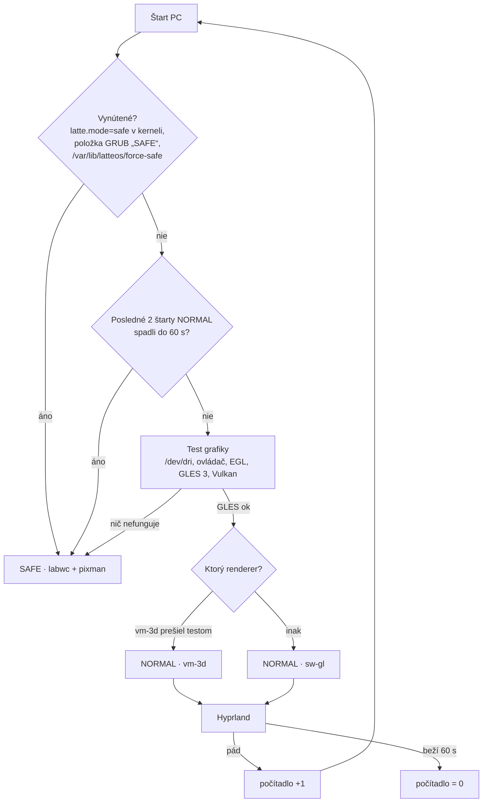

# LatteOS — roadmapa (nový štart)

23. 9. 2026 · @Arkay · návrh v0.1

Podklad: [technologický radar](inspo/LatteOS%20–%20technologický%20radar%202026.md),
prebraté zdroje v [resources/](resources/MANIFEST.md). Priečinok `old/` sa už **nemení**, slúži len na čítanie.

## Rámec

| | Teraz (fázy F0–F8) | Neskôr |
|---|---|---|
| Systém | **Fedora Server 44**, klasický (dnf) | Fedora Atomic (bootc / rpm-ostree), štýl Bazzite, **až keď bude všetko hotové** |
| Stroj | **VirtualBox VM** `latteOSdev`: VMSVGA, 128 MB VRAM, 3D zapnuté, 4 vCPU, 11 GB RAM | reálny PC s 3D grafikou **AMD aj NVIDIA** |
| Grafika | **softvérová** (llvmpipe / pixman), VMSVGA 3D len ako doplnková možnosť | plná HW akcelerácia, Vulkan |

**Pravidlo pre všetko, čo vznikne teraz:** musí to bežať vo VM bez GPU. HW akcelerácia môže
iba pridať efekty, nikdy nesmie byť podmienkou fungovania.

## Odpoveď: pobeží stack bez akcelerácie?

Stav hosťa (overené na `latteOSdev`): adaptér `VMware SVGA II [15ad:0405]`, ovládač `vmwgfx`,
schopnosti `3D, dx, SM_5`. Kernel pritom hlási *„vmwgfx seems to be running on an unsupported
hypervisor. This configuration is likely broken.“* 3D cesta VirtualBoxu je preto menej spoľahlivá
ako vo VMware a nesmieme na nej stavať.

Vo VM prichádzajú do úvahy tri grafické cesty:

- **A · sw-gl:** GL cez llvmpipe na CPU. 3D je vypnuté alebo sa ignoruje (`MESA_LOADER_DRIVER_OVERRIDE=kms_swrast`, pozri F0).
- **B · vm-3d:** Mesa ovládač `svga` nad VMSVGA 3D.
- **C · pixman:** čisté CPU kreslenie, žiadne GL.

| Komponent | A · sw-gl | B · vm-3d | C · pixman | Poznámka |
|---|---|---|---|---|
| **Hyprland 0.56** | ✅ očakávané | ⚠️ len s [patchom](resources/patches/README.md) | ❌ | Vyžaduje GLES 3 cez EGL/GBM a pixman renderer nemá. llvmpipe GLES 3.2 poskytuje. Pod B bez patchu padajú GPU klienti (čierna plocha). |
| labwc (wlroots) | ✅ | ⚠️ patch pre wlroots | ✅ `WLR_RENDERER=pixman` | Jediný kompozitor zo zoznamu, ktorý beží **úplne bez GL**, preto je základom SAFE. |
| Quickshell / DMS / Caelestia | ✅ pomalšie | ⚠️ | ⚠️ len `QT_QUICK_BACKEND=software` | `ShaderEffect` (materiály tém) na llvmpipe beží, na Qt software backende nie. |
| xdph, hyprlock, matugen, portály | ✅ | ✅ | ✅ | nenáročné |
| Mission Center, cosmic-files | ✅ | ✅ | ✅ | GTK4/iced majú softvérovú cestu |
| Ollama | ✅ CPU | — | — | vo VM len malý model 3–4B; Qwen3-14B-sk (Q4 ~9 GB) sa nezmestí popri desktope |
| Steam, umu, Proton | ⚠️ launcher áno, hry prakticky nie | ⚠️ | ❌ | DXVK/vkd3d potrebujú Vulkan; lavapipe je len na smoke test |
| gamescope | ❌ | ❌ | ❌ | potrebuje skutočný Vulkan + DRM → **fáza HW** |
| Valve Lepton | ❌ | ❌ | ❌ | mountuje Mesa/zink z hostiteľa, cieľ je Steam Frame → **fáza HW** |

✅ = funguje, ⚠️ = s obmedzením, ❌ = nefunguje. Stĺpce „očakávané“ vychádzajú z dokumentácie a
hlásení používateľov. **Prvá úloha F1 je overiť celú tabuľku meraním na `latteOSdev`.**

**Záver:** Hyprland aj navrhované nástroje môžu bežať bez akcelerácie (cesta A). Na VMSVGA 3D
(cesta B) pobežia iba s patchom `vmwgfx-dmabuf`. Predvolená cesta vo VM bude A. Cestu B zapne
selektor iba vtedy, keď prejde test. SAFE režim stojí na ceste C.

## Režimy: NORMAL a SAFE

| | **NORMAL** | **SAFE** |
|---|---|---|
| Kompozitor | Hyprland (+ vmwgfx patch) + Lua modul LatteOS | labwc (balík Fedory) |
| Renderer | GLES: vm-3d → sw-gl podľa testu | **pixman** (nulová závislosť na GL/EGL/GPU) |
| Shell | plný LatteOS shell (Quickshell) | minimálny: foot + fuzzel + `latte-safe` ponuka; žiadne shadery, žiadna priehľadnosť |
| Efekty | podľa stupňa výkonu (vo VM tier **Softvér** = téma Úsporná) | žiadne |
| Účel | bežná práca | štart pri akomkoľvek probléme: rozbitý GPU stack, pád shellu, zlý update, chýbajúci ovládač |
| Ponuka `latte-safe` | — | diagnostika (log posledného pádu), „skúsiť NORMAL znova“, „vrátiť posledný update“, terminál, sieť |

SAFE musí naštartovať aj s parametrom kernelu `nomodeset`: labwc + pixman beží nad `simpledrm`.
Je to posledná záchrana, ktorá funguje s hocijakou grafikou.

### Výber režimu pri štarte — `latte-mode-select`

Beží pri každom štarte **pred** grafickou reláciou (systemd služba pred greetd). Výsledok zapíše
do `/run/latteos/mode.toml`. Ten súbor je jediné miesto pravdy: číta ho greeter, Hyprland Lua
modul aj shell.

- **Počítadlo pádov:** rovnaký princíp ako `systemd-bless-boot`. Počítadlo sa nuluje, až keď
  relácia vydrží 60 s a shell sa ohlási.
- **Test grafiky** (`latte-gpu-probe`): PCI ID a ovládač, `eglinfo` (GBM platforma, renderer
  `llvmpipe` vs. `SVGA3D`), GLES 3.x a `vulkaninfo`. Výstupom je `renderer = vm-3d | sw-gl | none`
  a `tier`. Neskôr ten istý test použije Device Manager na reálnom HW (stupne Plný…Minimálny,
  pripnutie NVIDIA vetvy 580/595).
- **Ručná voľba:** v GRUB-e sú vždy dve položky, „LatteOS“ a „LatteOS SAFE“. V greeteri je prepínač
  režimu pre ďalšie prihlásenie.
- **Návrat:** z SAFE ide jedným klikom „skúsiť NORMAL“ (vynuluje počítadlo). V NORMAL sa dá zapnúť
  „nabudúce SAFE“.

## Fázy

### F0 — Základ VM *(hotové 23. 9. 2026)*
- [x] Fedora 44 Server vo VirtualBoxe, VMSVGA s 3D.
- [x] Root LV rozšírený z 15 GB na celý disk (52 GB, `lvextend -r`), Fedora Server ho predvolene nechá malý.
- [x] Všetky balíky cez [setup/f0-install.sh](setup/f0-install.sh) (23. 9. 2026): Mesa 26.2.3, VirtualBox guest additions
  (`vboxservice` beží), COPR `lionheartp/Hyprland` (Hyprland 0.56.2, Quickshell 0.3.1, matugen 4.2), labwc 0.9.6,
  greetd a tuigreet, PipeWire, portály, písma, vývojové nástroje (C++, Rust, Go, rpm-build) a Ollama.
- [x] Snapshot VM „f0“ (čistý základ) vo VirtualBoxe.

**Namerané v F0** (bez spustenej relácie, `eglinfo -B -p gbm`, `vulkaninfo`):

| Cesta | Ako | EGL/GLES renderer |
|---|---|---|
| B · vm-3d | predvolené | `SVGA3D`, **iba GLES 3.0** |
| A · sw-gl | `MESA_LOADER_DRIVER_OVERRIDE=kms_swrast` | `llvmpipe`, **GLES 3.2** |
| Vulkan | predvolené | iba `llvmpipe` (lavapipe), žiadny HW Vulkan |

`LIBGL_ALWAYS_SOFTWARE=1` ani `GALLIUM_DRIVER=llvmpipe` na platforme GBM **nefungujú**, treba
`MESA_LOADER_DRIVER_OVERRIDE`. Cestu A bude pre Hyprland nastavovať `latte-mode-select`.

### F1 — Grafický stack a režimy *(prvá priorita, všetko ostatné na ňom stojí)*
- [ ] Zmerať tabuľku kompatibility (A/B/C) na `latteOSdev`: štart, FPS, vyťaženie CPU, pády.
- [ ] Vlastný balík `hyprland-latte`: SRPM z COPR + `hyprland-0.56.2-vmwgfx-dmabuf.patch`, vlastný COPR `latteos`.
- [ ] Doplnky pre VM v Lua: `no_hardware_cursors`, bez blur/tieňov, pri sw-gl `MESA_LOADER_DRIVER_OVERRIDE=kms_swrast` pre kompozitor aj klientov.
- [ ] `latte-gpu-probe` (Rust, CLI) → `/run/latteos/mode.toml`.
- [ ] `latte-mode-select` + počítadlo pádov + GRUB položka SAFE.
- [ ] SAFE relácia: labwc + pixman + foot + fuzzel + `latte-safe` ponuka. Overiť aj s `nomodeset`.
- [ ] Greeter (greetd) s voľbou režimu.

### F2 — Hyprland Lua modul LatteOS
- [ ] Načíta `mode.toml` a nastaví blur, tiene, animácie a glow podľa stupňa. Nový stupeň **Softvér** pre VM.
- [ ] Režimy okien: nekonečná páska (scrolling layout), dlaždice, plávajúce.
- [ ] Pravidlá okien, skratky (Super+Tab, Super+D, Super+Shift+šípka).

### F3 — Shell
- [ ] Porovnať DMS a Caelestia vo VM (cesta A): RAM, CPU v pokoji, plynulosť. Rozhodnúť a forknúť (radar: otvorená otázka).
- [ ] Spodná lišta z ostrovov: App Manager, čas a notifikácie, Latte a páska, Text Bar, kapsa, súbory a zariadenia.
- [ ] Prehľad pásky (Super+Tab) nad IPC Hyprlandu.
- [ ] Téma **Latte** a **Úsporná** (vo VM bez `ShaderEffect`), farby cez matugen.
- [ ] Každý prvok shellu musí mať variant bez shaderov.

### F4 — Systémové služby (Rust)
- [ ] Device Manager: stavia na `latte-gpu-probe`, udisks2, NetworkManager, PipeWire.
- [ ] Process Manager: náhrada Ctrl+Alt+Del, autoruns, HW info (vzor Mission Center).
- [ ] Data Manager: pohľad „Tento počítač“ z udisks2, dva panely (vzor cosmic-files).
- [ ] App Manager: dnf + Flatpak (neskôr rpm-ostree), jednotné IPC so shellom.

### F5 — Stabilita a pamäť
- [ ] Port `resources/upstream/ubuntu-settings/oom/` do Fedory: premapovať GNOME služby na LatteOS
  (Hyprland, shell, PipeWire, portály, dbus-broker) a nastaviť `ManagedOOMMemoryPressure=auto` pre `user@.service`.
- [ ] Profil „hra má prednosť“ (zatiaľ len konfigurácia).
- [ ] Test: zaplniť RAM vo VM, relácia musí prežiť.

### F6 — Bezpečnostný model *(hlavný diferenciátor)*
- [ ] Trusted/untrusted profily nad Flatpak portálmi a bubblewrapom.
- [ ] Tlačidlo NET na aplikáciu, zatiaľ pre natívne a Flatpak aplikácie.
- [ ] Setup Plan dialóg (vzor Flatseal).

### F7 — AI a Text Bar
- [ ] Ollama na CPU s malým modelom (3–4B). Router lokálne/online.
- [ ] Text Bar: 4 režimy (Lokálne, Web, AI, Linux príkaz) a potvrdenie deštruktívnych príkazov.

### F8 — Herná vrstva (len integrácia, bez výkonu)
- [ ] Steam, umu-launcher, Proton 11: inštalácia, spustenie launchera, integrácia do App Managera.
- [ ] Prepínač „Desktop ↔ Hra“ ako UI, zatiaľ bez gamescope.

### H — Reálny hardvér *(keď bude pripravený PC s AMD aj NVIDIA)*
- [ ] `latte-gpu-probe` rozšíriť o stupne Plný / Štandard / Úsporný / Minimálny.
- [ ] NVIDIA: RPM Fusion `akmod-nvidia` (595+) a `akmod-nvidia-580xx` pre GTX 900/10xx. Nikdy nemeniť vetvu ovládača bez overenia.
- [ ] AMD: Mesa RADV.
- [ ] gamescope herná relácia, MangoHud, HDR/VRR.
- [ ] Lepton (Android hry), Qwen3-14B-sk.
- [ ] SAFE režim ostáva ako záchrana, napríklad pri zlom ovládači NVIDIA.

### A — Fedora Atomic *(až keď bude F0–F8 + H hotové)*
- [ ] Obraz LatteOS cez bootc / rpm-ostree podľa vzoru Bazzite (`resources/upstream/bazzite`).
- [ ] „Vrátiť včerajší systém“ v App Manageri. SAFE ponuka dostane rollback rpm-ostree.

## Otvorené otázky
- DMS alebo Caelestia ako základ shellu. Rozhodne meranie v F3.
- Vydrží llvmpipe na 4 vCPU plynulé animácie shellu pri 1080p? Ak nie, tier Softvér vypne animácie úplne.
- Vlastný COPR `latteos`, alebo lokálne RPM repo počas vývoja?
