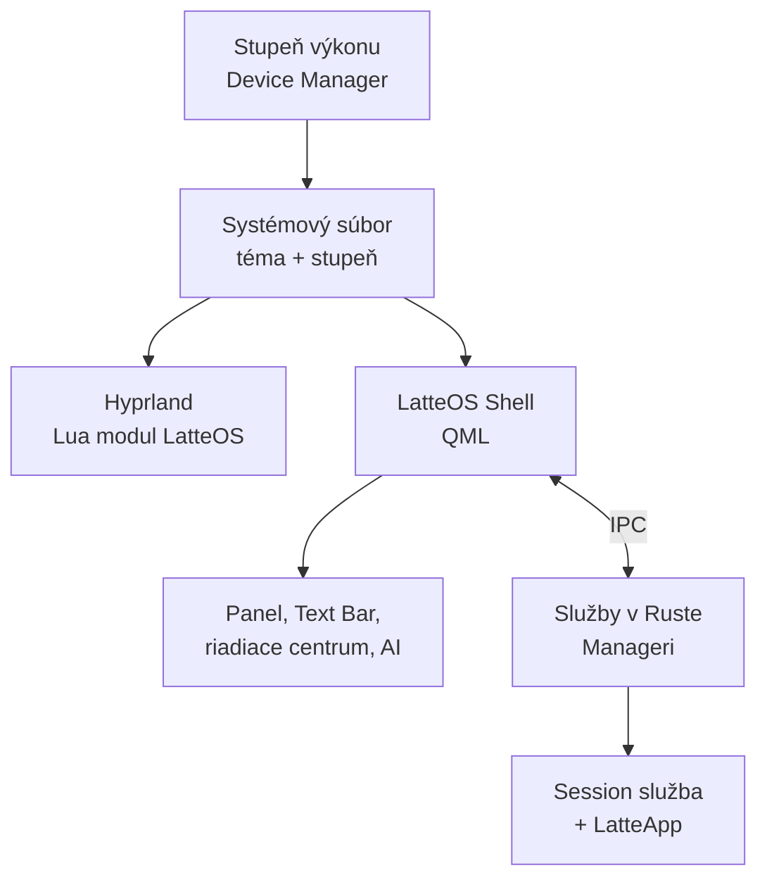

# LatteOS – technologický radar 2026

Sep 23, 2026 · @Someone

## Zhrnutie

LatteOS je herná distribúcia na Fedora Atomic s Hyprlandom, ktorá spája najlepšie open-source projekty 2026 pod jednu strechu a predáva len uzavretú službu na prenos účtu. Cieľový klient je každý PC s Vulkanom a vekom do 10 rokov.

**Hlavné rozhodnutia k 23. 9. 2026:**

- **Základ:** Fedora Atomic (rpm-ostree), štýl Bazzite, s možnosťou návratu na predchádzajúci systém.
- **Kompozitor:** nezmenený Hyprland; správanie LatteOS ako Lua vrstva (od 0.55), **bez forku**.
- **Shell:** jeden zjednotený shell (Caelestia princíp „jeden mozog“), QML rozhranie + kompilovaný backend (model DankMaterialShell).
- **Rust:** pre systémové služby (Manageri, bezpečnostný model, Session klient), nie pre každý panel.
- **OS je otvorený.** Platí sa iba za uzavretú službu: šifrované úložisko profilu, prihlásenie na cudzom PC a mobilná LatteApp.
- **AI:** lokálne AI (slovenský Qwen3-14B-sk podľa výkonu) smú na Shell; online AI je iba webový panel bez prístupu k systému.
- **Hry:** Steam + Proton, Android hry cez Valve Lepton, NVIDIA aj AMD sú povinné od prvého dňa.

**Diferenciácia:** Hyprland + hotový shell pod jednou strechou už ponúka CachyOS. LatteOS musí pridať to, čo nikto nespája: atomic stabilitu, hernú reláciu, NVIDIA bez ladenia, trusted/untrusted aplikácie, Managerov a prenosnú reláciu.

## Technologický radar

Najdôležitejšie novinky posledných mesiacov, zoradené od najnovšej. Každá má verdikt pre LatteOS.

| Dátum | Novinka | Čo prináša | Verdikt pre LatteOS |
| --- | --- | --- | --- |
| 21. 9. 2026 | [Ubuntu 26.10 OOM politika](https://itsfoss.com/news/ubuntu-26-10-oom-policy/) | Pri nedostatku RAM padajú aplikácie, nie relácia; 39 služieb s nižším OOM skóre | **Prebrať** – konfigurácia, prenášateľná do Fedory |
| 18. 9. 2026 | [Valve Lepton](https://itsfoss.com/news/valve-lepton/) | Android hry v kontajneri, každá hra vlastný kontajner; MIT + GPL-3.0 | **Prebrať** – Android vrstva |
| 14. 9. 2026 | [macOS 27 Golden Gate](https://www.macrumors.com/roundup/macos-27/) | Posuvník priehľadnosti Liquid Glass, jednotné rohy okien | **Inšpirácia** – posuvník „sklo ↔ čitateľnosť“ |
| 8. 9. 2026 | [Windows 11 september](https://tech.sportskeeda.com/laptops/news-everything-new-windows-11-september-2026-update) | Vypínateľné sekcie Štartu, lokálne vyhľadávanie bez webu | **Inšpirácia** – Text Bar bez balastu |
| 7. 9. 2026 | [Barney](https://itsfoss.com/news/ikey-doherty-barney/) | Rust nástroj na stavbu distribúcií zo zdrojov, MPL-2.0 | **Sledovať** – študijný materiál |
| 20. 7. 2026 | [Hyprland 0.56](https://hypr.land/news/update56/) | Lua gestá, eventy, REPL, gradientné tiene a glow, bez breaking changes | **Základ** – Lua vrstva LatteOS |
| 14. 7. 2026 | [Noctalia v5](https://tux.fan/2026/07/14/noctalia-wayland-desktop-shell-2026/) | Shell bez Qt, C++ na OpenGL ES, TOML s hot reloadom; MIT; alfa | **Sledovať** – model pre natívny shell |
| júl 2026 | [Proton 11](https://github.com/ValveSoftware/Proton/releases/tag/proton-11.0-1) | Wine 11, FEX pre ARM64EC, nové dxvk a vkd3d | **Prebrať** – predvolený Proton |
| jún 2026 | [CachyOS + Noctalia](https://www.linuxjournal.com/content/cachyos-june-2026-iso-released-hyprland-noctalia-faster-performance-and-smarter-system) | Hyprland s hotovým shellom priamo v inštalátore | **Konkurencia** – treba ísť ďalej |
| máj 2026 | [Hyprland 0.55](https://alternativeto.net/news/2026/7/hyprland-0-56-adds-new-layout-options-and-expands-lua-api-features/) | Lua konfigurácia, Layout API, ICC profily | **Základ** – dôvod ne-forkovať |
| máj 2026 | [Aluminium OS](https://en.wikipedia.org/wiki/Aluminium_OS) | Android pre PC, nahrádza ChromeOS | **Inšpirácia** – obnova relácie |
| marec 2026 | [Qwen3-14B-sk](https://www.veda.sk/slovensky-jazykovy-model-qwen3-14b-sk-slovencina-ai/) | Slovenský model od JUĽŠ SAV, verejne dostupný | **Prebrať** – hlavné lokálne AI |
| marec 2026 | [NVIDIA 595](https://ubuntuhandbook.org/index.php/2026/03/nvidia-595-58-03-released-with-better-wayland-linux-gaming-support/) | modeset=1 predvolene, VK\_EXT\_present\_timing | **Základ** – minimálna verzia ovládača |
| priebežne | [DankMaterialShell](https://github.com/AvengeMedia/DankMaterialShell) | Quickshell + Go backend, RPM pre Fedoru, pluginy s lock súborom | **Prebrať / forknúť** – základ shellu |

**Trend pod tým všetkým:** shell vrstva sa zjednocuje. Namiesto zlepenca Waybar + mako + wofi + swaylock vznikajú hotové shelly s jedným konfigom a pluginmi.

## Čo prebrať a čo vytvoriť

Pravidlo: píšeš sami iba to, čím sa LatteOS líši. Všetko bežné sa preíma, forkuje alebo integruje.

| Vrstva | Prebrať (projekt) | Vytvoriť sami | Poznámka |
| --- | --- | --- | --- |
| Základ OS | Fedora Atomic, rpm-ostree | Obraz LatteOS, návrat „vratiť včerajší systém“ v App Manageri | Vzor: Bazzite, A/B nápad z ObsidianOS |
| Kompozitor | Hyprland (BSD) | Lua modul LatteOS: layouty, gestá, pravidlá okien, herný režim | Bez forku |
| Shell | DankMaterialShell alebo Caelestia ako základ | Vlastné moduly: Text Bar, riadiace centrum, AI panel | Licencie over pred forkom |
| Herná relácia | gamescope, Steam, Proton 11, umu-launcher | Prepínač „Desktop ↔ Hra“, profil výkonu | — |
| Android | Valve Lepton (Waydroid základ) | Integrácia do App Managera, ikonky v launcheri | Jeden kontajner na hru |
| Windows aplikácie | Wine, Bottles, umu | Wizzard, ktorý vyberie runtime sám | Microsoft 365 v Bottles je zatiaľ experiment |
| Bezpečnosť | Flatpak portály, bubblewrap, SELinux | **Trusted/untrusted model, tlačidlo NET na aplikáciu** | Hlavný diferenciátor |
| Pamäť a stabilita | systemd-oomd, OOM skóre podľa Ubuntu 26.10 | Profil „hra má prednosť“ | Konfigurácia, nie kód |
| Systémoví Manageri | Mission Center, cosmic-files ako vzor | **App, Process, Device, Data, Session Manager v Ruste** | Jednotný vzhľad cez shell |
| AI | Ollama, Qwen3-14B-sk | Router lokálne/online, príkazy pre Shell | Online len webview |
| Prenos účtu | Passkeys/WebAuthn, TOTP, lock súbor pluginov (DMS) | **Uzavretá Session služba + LatteApp** | Jediný platený komponent |
| Zdieľanie obrazovky | xdg-desktop-portal-hyprland | — | Discord, OBS fungujú hneď |
| Témy | matugen (farby z tapety) | Galéria tém, posuvník skla | Inšpirácia: HyDE, macOS 27 |

**Tučne** sú komponenty, ktoré nikde inde hotové nie sú a tvoria identitu LatteOS.

## Najmodernejšie funkcie

Každý komponent LatteOS dostane 2–4 funkcie, ktoré už niekde fungujú a používatelia ich chcú. Zdroj inšpirácie je v zátvorke.

**Text Bar** (spúšťač a vyhľadávanie)

- Predvolene **prepínacia ikonka** na začiatku baru: Lokálne (funkcie, nastavenia, programy, súbory) · Web (wiki LatteOS + vybrané vyhľadávače) · AI · Linux príkaz.
- V Nastaveniach voľba podoby baru: **ikonka** (predvolené) alebo **prefixy** pre pokročilých (`?` AI, `!` príkaz, `/` web).
- AI režim sám rozpozná žiadosť o obrázok a pošle ju obrazovému modelu.
- Režim Linux príkaz: pred deštruktívnym príkazom náhľad a potvrdenie, bez root práv, kým ich používateľ výslovne nepotvrdí.
- Iba lokálne výsledky, web až v režime Web (Windows 11 september).

**Riadiace centrum** (rýchla tvár Device Managera)

- Dlaždice so stránkami: klik na Bluetooth otvorí zoznam zariadení (Colorshell).
- Herný blok: FPS limit, profil výkonu, HDR, VRR jedným klikom.
- Posuvník „sklo ↔ čitateľnosť“ pre celý systém (macOS 27).

**Prehľad okien** (Super+Tab)

- Živé náhľady, prenos okien medzi plochami ťahaním (End-4).
- Tapeta podľa plochy, napríklad iná pre hernú plochu (Arch Eclipse).

**AI panel**

- Lokálne AI s prístupom k nastaveniam systému (End-4 + Ollama).
- Záložky online AI ako webview, bez API a bez prístupu k systému (sh1zicus prístup, bez API kľúčov).
- OCR: text z hoci čoho na obrazovke do schránky (HyDE).

**App Manager a Wizzard**

- Inštalácia jedným klikom bez ohľadu na formát: Flatpak, RPM, Windows .exe, Android .apk.
- Návrat systému po zlom update (rpm-ostree, A/B princíp).
- Vynútené kritické bezpečnostné záplaty.

**Process Manager**

- Ochrana relácie pri nedostatku RAM: najprv padajú aplikácie (Ubuntu 26.10).
- Profil „hra má prednosť“: pozadie sa priškrtí, kým beží hra.

**Session Manager**

- Obnova relácie presne tak, ako si ju nechal, aj po pripojení na iný PC (Android desktop režim).
- Reprodukovateľné pluginy a nastavenia cez lock súbor (DMS).

**Nastavenia**

- Všetko prepínačmi, žiadne editovanie súborov (ML4W).
- Galéria komunitných tém, ktorá prefarbí celý systém naraz (HyDE).

## Podpora populárnych aplikácií

Väčšina najpoužívanejších aplikácií beží na Linuxe natívne alebo cez Proton. Slabé miesta sú hry s kernel anti-cheatom a Adobe. Úlohou LatteOS je, aby používateľ nemusel vedieť, ktorá cesta sa použije.

| Kategória | Aplikácie | Cesta v LatteOS | Stav |
| --- | --- | --- | --- |
| Hry – Steam | Steam knižnica | Natívny Steam + Proton 11 | Výborný |
| Hry – iné obchody | Epic, GOG, Ubisoft, EA, Battle.net | Heroic / Lutris + umu-launcher, integrované do App Managera | Dobrý |
| Hry s anti-cheatom | Fortnite, Valorant, niektoré CoD | Nedajú sa spustiť; LatteOS to povie vopred podľa databázy Are We Anti-Cheat Yet | Blokované vydavateľom |
| Android hry | Mobilné tituly | Valve Lepton, kontajner na hru | Nové, experimentálne |
| Komunikácia | Discord, Signal, Telegram, WhatsApp web | Flatpak + funkčné zdieľanie obrazovky cez portál | Výborný |
| Streaming a video | OBS, DaVinci Resolve, Kdenlive | Natívne; NVIDIA/AMD kódovanie | Dobrý |
| Hudba | Spotify, YouTube Music | Flatpak / webová aplikácia | Výborný |
| Prehliadače | Firefox, Chrome, Brave, Zen | Natívne | Výborný |
| Kancelária | LibreOffice, OnlyOffice, Microsoft 365 web | Natívne; desktop M365 cez Bottles je zatiaľ experiment | Dobrý |
| Grafika | Krita, GIMP, Inkscape, Blender | Natívne | Výborný |
| Adobe | Photoshop, Premiere | Nepodporované; Wizzard ponúkne alternatívu | Slabý |
| Periférie | Gamepady, RGB, myši | Steam Input, OpenRGB, Piper | Dobrý |

**Funkcia na vytvorenie: „Bude to fungovať?“** Pred inštaláciou hry alebo aplikácie Wizzard ukáže hodnotenie (ProtonDB, Deck Verified, anti-cheat databáza) a zvolenú cestu. Používateľ už nikdy nemusí googliť.

Podklad: Proton je jediná cesta pre väčšinu nových hier, lebo natívnu Linux verziu má len asi 13 % nových titulov na Steame ([commandlinux](https://commandlinux.com/statistics/proton-game-compatibility-on-linux/)).

## Lokálne a online AI

Hlavným slovenským AI bude [Qwen3-14B-sk](https://www.veda.sk/slovensky-jazykovy-model-qwen3-14b-sk-slovencina-ai/) od JUĽŠ SAV cez Ollamu. Model sa vyberá automaticky podľa výkonu PC.

| Výkon PC | Model | Čo AI robí |
| --- | --- | --- |
| Bez vhodnej GPU, do 16 GB RAM | Malý model 3–4B | Text Bar, jednoduché príkazy |
| 8 GB VRAM | Malý model alebo Qwen3-14B-sk s čiastočným presunom do RAM | Asistent, pomalšie odpovede |
| 12 GB VRAM a viac | Qwen3-14B-sk (Q4) | Plný slovenský asistent, ovládanie systému |
| 32 GB+ RAM | MoE modely, napr. qwen3.6:35b-a3b | Náročnejšie úlohy |

**Pravidlá:**

- Na Shell a systémové nastavenia smú iba lokálne modely.
- Online AI (ChatGPT, Gemini, DeepSeek, Claude) je záložka s webview. Používateľ sa prihlási bežným účtom, bez API.
- Automatické skriptovanie webových chatov sa **nerobí**: porušuje podmienky služieb a rozbije sa pri každej zmene stránky.
- LoRA sa použije na štýl a príkazy LatteOS, nie na učenie jazyka. Ollama ju načíta cez `ADAPTER` v Modelfile.
- Na porovnanie slovenských modelov slúži [SlovakBench](https://slovakbench.sk/).

## Škálovanie hardvéru

Klientom je každý PC s Vulkanom a GPU z roku 2016 alebo novšou. Pri prvom štarte Device Manager spustí test (Vulkan, VRAM, RAM, CPU) a zvolí jeden zo 4 stupňov; používateľ ho môže zmeniť.

| Stupeň | Príklady GPU | Efekty UI | Hry | Lokálne AI |
| --- | --- | --- | --- | --- |
| **Plný** | RTX 3060+, RX 6700+, 10 GB+ VRAM | Plné sklo, blur, glow, animácie 120+ Hz, HDR | Plné nastavenia, gamescope, HDR | Qwen3-14B-sk |
| **Štandard** | RTX 20xx, GTX 16xx, RX 5000/6600, 6–8 GB | Sklo s menším blurom, animácie plne | Stredné až vysoké | Malý model, 14B čiastočne v RAM |
| **Úsporný** | GTX 10xx, RX 400/500, 4–8 GB | Bez blur, tieňe vypnuté, krátke animácie | Staršie a nenáročné tituly | Malý model |
| **Minimálny** | Intel UHD 600+, AMD Vega/RDNA iGPU | Plochy bez priehľadnosti, minimálne animácie | Indie, emulátory, cloud gaming | Iba online panel alebo malý model |

Existuje jeden LatteOS pre všetkých; stupeň je len vnútorné nastavenie, ktoré si systém zvolí sám. Kávové názvy patria veľkým verziám: 1.0 Arabica, 2.0 Robusta, potom Liberica, Excelsa, Stenophylla.

**Kritická pasca: staršie NVIDIA karty.** Vetva 580 je posledná pre Maxwell, Pascal a Volta, teda aj GTX 10xx ([Phoronix](https://www.phoronix.com/news/NVIDIA-580-Linux-Driver-Last-HW)). Nová vetva 595 ich zámerne vynechala ([InGameNews](https://www.ingamenews.com/2026/04/nvidia-releases-58015903-linux-driver.html)). Na Arch Linuxe to po update nechalo používateľov bez grafického prostredia ([Arch fórum](https://bbs.archlinux.org/viewtopic.php?id=311143)). LatteOS preto musí:

1. Rozpoznať architektúru GPU pred inštaláciou ovládača.
2. GTX 900/10xx natrvalo pripnúť na vetvu 580, Turing a novšie na aktuálnu (595+).
3. Nikdy nedovoliť update, ktorý vymení vetvu ovládača bez overenia.

**Technicky:** Hyprland Lua konfigurácia načíta stupeň zo systémového súboru a nastaví blur, tiene a animácie. Shell číta ten istý súbor. Jedno miesto pravdy, žiadne ručné ladenie.

**Bez Vulkanu** sa LatteOS nainštaluje iba v núdzovom režime (labwc) so správou, prečo herný režim nie je dostupný.

### Podpora ovládača NVIDIA

Aktuálny ovládač podporuje iba karty od Turingu; staršie dostávajú už len bezpečnostné opravy a tie končia v októbri 2028 ([BGR](https://www.bgr.com/2045248/why-nvidia-discontinued-support-pascal/), [NVIDIA](https://nvidia.custhelp.com/app/answers/detail/a_id/5706/~/nvidia-quadro-support-plan-for-maxwell,-pascal,-and-volta-gpus.)).

| Vetva | Karty | Stav |
| --- | --- | --- |
| 595+ (aktuálna) | GTX 16xx, RTX 20/30/40/50 | Plná podpora |
| 580 (legacy) | GTX 750, 900, 10xx, Titan V | Iba bezpečnostné opravy do 10/2028 |
| 470 (legacy) | GTX 600/700 Kepler | Skončená, mimo okna LatteOS |

### Plán: udržať 10-ročné GPU pri živote

Stará karta nikdy nesmie skončiť s čiernou obrazovkou. LatteOS pre ne má reťaz 5 záložných krokov; každý ďalší je slabší, ale stále funkčný.

1. **Legacy ovládač (do 10/2028).** RPM Fusion má balíky `akmod-nvidia-580xx` aj pre Fedoru 44 ([LinuxCapable](https://linuxcapable.com/how-to-install-nvidia-drivers-on-fedora-linux/)). Používateľ inštaluje ten istý LatteOS; inštalátor podľa GPU sám zvolí variant s legacy ovládačom, lebo dve verzie ovládača NVIDIA nemôžu byť v systéme naraz. Plný herný výkon, stupeň Úsporný.
2. **Komunitná údržba (po 2028).** Pri vetve 390 udržiavali ovládač pre nové kernely správcovia RPM Fusion ešte roky po NVIDII, hoci čoraz ťažšie ([Nvidia Fedora Guide](https://github.com/fady-saied/Nvidia-Fedora-Guide)). LatteOS to môže využiť, ale s jasným upozornením: ovládač bez bezpečnostných opráv.
3. **Otvorený ovládač Nouveau + NVK.** NVK je Vulkan 1.4 konformný aj na Maxwell a Pascal ([Phoronix](https://www.phoronix.com/news/NVK-Vulkan-1.4-Maxwell)). Problém: GTX 900/10xx zostávajú na základných taktoch, takže stačia sotva na plochu ([Collabora](https://www.collabora.com/news-and-blog/news-and-events/nvk-enabled-for-maxwell,-pascal,-and-volta-gpus.html)). Výnimka je GTX 750/750 Ti: s ručným pretaktovaním dosiahne asi 80 % výkonu proprietárneho ovládača ([nouveau-reclocking](https://github.com/ventureoo/nouveau-reclocking)). Stupeň Minimálny: plocha bez efektov, žiadne náročné hry.
4. **Hranie cez stream.** Starý PC sa stane tenkým klientom: natívna aplikácia GeForce NOW pre Linux vyšla z bety 13. augusta 2026 ([NVIDIA Blog](https://blogs.nvidia.com/blog/geforce-now-thursday-linux-native-app/)), alebo Steam Remote Play / Moonlight zo silnejšieho PC doma. LatteOS ponúkne tento režim jedným klikom.
5. **Poradca upgradu.** Device Manager ukáže najlacnejšiu kompatibilnú kartu (napr. použitá GTX 1650 alebo RX 6400) a čo s ňou získa.

**Automatika:** Device Manager rozpozná GPU podľa PCI ID, nie podľa názvu (názvy mobilných kariet klamú), a zvolí krok 1, 3 alebo 4. Používateľ vidí jednu vetu, napríklad: „Tvoja GTX 1060 má plnú podporu do októbra 2028.“

**AMD a Intel** tento problém nemajú v rovnakej miere: ich ovládače sú otvorené v Mesa a udržiava ich komunita, takže RX 400/500 a Intel UHD 600 ostávajú v bežnom obraze.

## Grafika a UI

Vizuálny jazyk LatteOS je „teplé sklo“: matné sklené panely nad tapetou, kávová základná paleta a akcent z tapety. Všetko kreslí jeden shell, takže celý systém vyzerá ako jeden produkt.

### Vizuálne pravidlá

- **Farby:** základ „Latte“ (krémová, espresso hnedá, mliečna biela) + akcent generovaný z tapety cez matugen. Svetlý aj tmavý režim.
- **Sklo:** blur a priehľadnosť podľa stupňa výkonu, plus jeden posuvník „sklo ↔ čitateľnosť“.
- **Tvary:** jeden polomer rohov pre okná aj panely (návrh 14 px), rovnaký v celom systéme.
- **Písmo:** jedna rodina pre UI (napr. Inter) a jedna pre kód a terminál (napr. JetBrains Mono).
- **Ikony:** jedna sada pre celý systém aj aplikácie.
- **Pohyb:** krátke pružné animácie 200–300 ms cez Bezier krivky Hyprlandu; v hernom režime vypnuté.
- **Aktívne okno:** jemný gradientný glow okraja (Hyprland 0.56), na slabšom HW len farebný okraj.

### Zloženie obrazovky

Pôvodný návrh s horným panelom a dockom je nahradený jednou spodnou lištou z ostrovov a nekonečnou páskou. Aktuálny stav je v sekcii **GUI – opis a funkcie** nižšie.

### Použiť vs. nepoužiť

| Použiť | Nepoužiť | Prečo |
| --- | --- | --- |
| Jeden shell na všetko | Waybar + AGS + Quickshell + mako naraz | Zlepenec sa rozbíja a vyzerá nejednotne |
| Farby z tapety (matugen) | Pywal aj Material You súčasne | Dva farebné enginy si protirečia |
| Sklo so stupňom podľa HW | Plný blur na iGPU | Zbytočne berie výkon hrám |
| Neutrálna predvolená téma | Anime/cyberpunk ako predvolené | Patria do galérie tém, nie do základu |
| Plávajúce okná + prichytávanie | Tiling ako jediná možnosť | Nováčikovia z Windows by odišli |
| Nastavenia prepínačmi | Konfiguračné súbory pre bežné veci | Cieľový používateľ je hráč, nie ricer |

### Ako to do seba zapadá

Jeden systémový súbor s témou a stupňom číta Hyprland aj shell, preto sa všetko mení naraz a jednotne.

### Prvky UI: obľúbenosť, nutnosť, spojenie s návrhmi

Z 22 prvkov je 12 nutných a 4 sú čisto LatteOS, ktoré nikto iný nemá. Obľúbenosť = ako bežný je prvok vo Windows, macOS, Androide a v 10 dotfiles z článku It's FOSS.

| Prvok | Obľúbenosť | Nutnosť | Tvoj nápad | Prebrať z |
| --- | --- | --- | --- | --- |
| Horný panel | Všade | Nutné | Ikonka Text Baru vľavo, indikátor NET a Session vpravo | DMS / Caelestia |
| Text Bar (hľadanie) | Všade (Start, Spotlight) | Nutné | 4 režimy prepínacou ikonkou | DMS spotlight, Colorshell runner |
| Dock / lišta aplikácií | Všade mimo rice | Nutné pre prechod z Windows | Automaticky skrývaný, napojený na App Manager | DMS / Noctalia dock |
| Riadiace centrum | Všade | Nutné | Herný blok, posuvník skla | Colorshell stránky |
| Notifikácie | Všade | Nutné | — | DMS / Noctalia |
| OSD (hlasitosť, jas) | Všade | Nutné | — | DMS / Noctalia |
| Zamknutie a prihlásenie | Všade | Nutné | Kód z LatteApp na cudzom PC, kontrola integrity pri prvom prihlásení | hyprlock, Noctalia Greeter |
| Nastavenia | Všade | Nutné | Všetko prepínačmi, voľba podoby Text Baru | ML4W Settings App |
| Data Manager | Všade | Nutné | Pohľad „Tento počítač“, dva panely á la Total Commander | cosmic-files |
| Process Manager | Všade (Ctrl+Shift+Esc) | Nutné | Autoruns, HW info á la CPU-Z | Mission Center |
| Herný režim | Herné systémy | Nutné pre gamerdistro | Prepínač Desktop ↔ Hra | gamescope, Steam, Bazzite |
| Screenshot a nahrávanie | Všade | Nutné | OCR do schránky, „Uprav slovom“ | HyDE OCR, OBS |
| Prehľad okien (Super+Tab) | macOS, GNOME, 3 z 10 rice | Odporúčané | — | End-4 overview |
| AI panel | Rastie (Copilot, Siri AI, Gemini, 3 z 10 rice) | Odporúčané, len na požiadanie | Lokálne AI so Shellom + webové záložky | End-4 AI sidebar |
| Správca schránky | Windows Win+V, shelly DMS a Noctalia | Odporúčané | Clipboard Manager na vlastnej skratke | DMS / Noctalia |
| Herný overlay (FPS, teploty) | Hráči | Odporúčané | Zapína sa z riadiaceho centra | MangoHud |
| Galéria tém a tapíiet | Rice, menej v OS | Voliteľné | Farby z tapety, sklo | HyDE, Noctalia |
| Widgety na ploche | Zmiešaná (Windows widgety sú neobľúbené) | Voliteľné, predvolene vypnuté | — | Noctalia pluginy |
| **Tlačidlo NET na aplikáciu** | Nikto takto | **Identita LatteOS** | Blokuje internet aj Windows aplikáciám | Vlastné |
| **Dialóg trusted/untrusted** | Nikto takto | **Identita LatteOS** | Setup Plan: schváliť celý, časť alebo upraviť | Vlastné (vzor Flatseal) |
| **Vrátiť včerajší systém** | Skryté v Atomic distribúciách | **Identita LatteOS** | Jedno tlačidlo v App Manageri | rpm-ostree |
| **Indikátor mobilného účtu** | Nikto takto | **Identita LatteOS** | Vidieť, že som prihlásený na cudzom PC, odhlásiť z mobilu | Vlastné |

**Zjednotenie:** všetky nutné prvky okrem Managerov dodá jeden shell (DMS alebo Caelestia). LatteOS k nemu pridá Text Bar, AI panel, herný blok a štyri tučné prvky, ktoré nikto iný nemá.

Pozn.: riadky „Horný panel“ a „Dock / lišta aplikácií“ v tabuľke nahradila jedna spodná lišta bez pripnutých ikon (sekcia nižšie).

## GUI – opis a funkcie

GUI stojí na troch prvkoch: jedna spodná lišta z oddelených ostrovov, nekonečná páska okien na každom monitore a prehľad, ktorý pásku oddiali. Vizuálne ho nesú témy materiálov. Obrazovky sú v [návrhu plochy](https://claude.ai/artifact/Eeqt3SCs3WHrhuSAZB9feL).

### Lišta zľava doprava

| Ostrov | Čo zobrazuje | Správanie |
| --- | --- | --- |
| App Manager | Obdĺžniková animovaná ikona so stavom sťahovania | Spúšťanie a inštalácia aplikácií; na lište nie sú pripnuté ikony |
| Čas · notifikácie · dátum | Čas, zvonček s počtom, dátum | Panel: kalendár, úlohy cez CalDAV, časové pásma, wellbeing (čas v aplikáciách, iba lokálne), notifikácie |
| Systém + páska | Šálka Latte, malý zobrazovač pásky | Latte: nastavenia, správca procesov, relácia, napájanie (nič nevypne priamo); zobrazovač: klik = prehľad, rovnako Super+Tab |
| Text Bar | Ikona režimu a pole | 4 režimy (Lokálne, Web, AI, Linux príkaz) prepína ikona; výsledky vyskočia na celú šírku baru; prefixy len voliteľne v Nastaveniach |
| Schránka (kapsa) | Kapsa so zníženými bokmi | Na kapse sedí jediná odložená vec a nakloní sa; vnútri sú sloty histórie schránky ako v Androide; nová odložená vec posunie predošlú do histórie; cieľ pre drag and drop |
| Súbory · plocha · zariadenia | Správca súborov, tenké tlačidlo plochy, Device Manager | Plocha: klik prepína čistú plochu a späť, podržanie = náhľad (okná takmer úplne priehľadné); Device Manager: pomaly sa striedajúca ikona (Wi‑Fi, batéria, zvuk) a mriežka miniikon |

Device Manager: prejdenie myšou zastaví striedanie a ukáže všetky stavy, kritický stav (batéria pod 20 %, výpadok siete) má prednosť, v Nastaveniach je voľba „obmedziť pohyb“.

### Okná: páska a režimy

- Každý monitor má vlastnú nekonečnú pásku, iba vodorovne.
- Stĺpec pásky drží jedno okno, viac okien pod sebou alebo karty; nad páskou je plávajúca vrstva.
- Režimy okien: **Nekonečná páska**, **Dlaždice**, **Plávajúce**.
- Ťahanie okna k okraju: pri zapnutej páske posúva pásku; pri vypnutej sa hore ukáže ponuka rozložení dlaždíc ako vo Windows 11.
- Drag and drop na vzdialené okno: podržať nad ním v zobrazovači pásky, alebo odložiť do kapsy.
- Kompozítor ostáva Hyprland (scrolling layout od 0.55), bez forku.

### Prehľad pásky

- Otvára ho klik na zobrazovač pásky alebo Super+Tab; gesto štyrmi prstami sa dá doplniť cez Lua gestá z Hyprlandu 0.56.
- Ukáže celú pásku monitora v jednom rade s rámikom viditeľnej časti; písaním sa okná filtrujú.
- Nad lištou je panel správy plochy: režim okien, rozdelenia (aktívne pri vypnutej páske), zoradenie.
- Inšpirácia: [niri overview](https://github.com/niri-wm/niri/wiki/Overview). Implementácia v Quickshelli nad IPC Hyprlandu, neskôr prípadne plugin.

### Témy

| Téma | Materiál | Reakcia a pohyb | Zatvorenie okna |
| --- | --- | --- | --- |
| Latte (predvolená) | Teplé tmavé sklo | Jemné animácie | Štandardné |
| Mráz | Ľad, mrazivé kresby rastú pri nečinnosti | Para nad šálkou topí mráz, mráz sa topí aj pod myšou | Okno zamrzne a rozsype sa |
| Brúsený hliník / striebro / zlato | Brúsený kov | Odlesk sa mení podľa myši; okno sa pri presune vlní ako plech | Zroluje sa ako plech |
| Biely onyx / onyx | Priesvitný kameň so žilkovaním | Svetlo presvitá cez kameň | Štandardné |
| Jantár | Teplá priesvitnosť s bublinkami | Svetlo presvitá | Štandardné |
| Rubín / zirkón | Fazety, kryštalická štruktúra | Fazety sa pri pohybe myši iskria; zirkón má dúhový oheň na hranách | Rozpad na fazety |
| Klasik – kancelária | Plochý svetlý vzhľad v štýle Windows | Bez efektov navyše | Štandardné |
| Klasik – herný launcher | Tmavomodrý vzhľad v štýle Steamu | Bez efektov navyše | Štandardné |
| Klasik – svetlé sklo | Svetlé priesvitné panely v štýle macOS | Jemné animácie | Štandardné |
| Úsporná (FPS) | Plné farby, bez priehľadnosti, tieňov a animácií | Žiadne | Okamžité |

Klasické témy preberajú farby a rozloženie, nie logá ani presné kópie cudzieho dizajnu. Ďalšie nápady: svetlo na materiáloch podľa dennej doby, jemný náklon panelov ku kurzoru (±2°), otvorenie okna zo zobrazovača pásky, animované tapety (GIF, video), ktoré sa počas hry a na batérii pozastavia.

### Kde efekty bežia

- **Shell (Quickshell, Qt `ShaderEffect`):** materiály lišty a panelov. Hlavné miesto, lacné na výkon ([Qt ShaderEffect](https://doc.qt.io/qt-6/qml-qtquick-shadereffect.html)).
- **Kompozítor:** animácie, blur, glow; shadery okien cez pluginy ([Hypr-DarkWindow](https://github.com/micha4w/Hypr-DarkWindow), [HyprWindowShade](https://github.com/ManofJELLO/HyprWindowShade)); vlnenie okien existuje ako [WiggleWobble](https://git.allpurposem.at/mat/WiggleWobble/src/commit/15602acda6eafee8b0a9c7d4e830c3533261985c), ale je neudržiavaný, takže treba vlastný plugin.
- **Stupne výkonu:** Plný = všetko; Štandard = materiály bez svetla podľa myši; Úsporný = statické textúry; Minimálny = téma Úsporná. Počas hry sa efekty pozastavia.
- **Riziká:** čitateľnosť textu na textúrach (text vždy na pokojnej podložke), údržba pluginov pri nových verziách Hyprlandu, množstvo grafickej práce na tému.

### Otvorené otázky GUI

- **Presun okna na iný monitor – rozhodnuté:** obyčajné potiahnutie cez okraj monitora. Pre klávesnicu navyše Super+Shift+šípka.
- **Kapsa – rozhodnuté:** navrchu vždy len jedna odložená vec; história schránky v slotoch vnútri.
- **Prepnutie pásky na Dlaždice pri veľa oknách – návrh:** neodmietnuť ani neskrývať voľbu. Dlaždíc bude toľko, koľko sa zmestí (napr. 4 na 24", 6 na 27" a viac), zvyšné okná sa zbalia ako karty do poslednej dlaždice. Krátke oznámenie: „8 okien → 4 dlaždice, zvyšok ako karty.“ Pri Plávajúcich sa okná poukladajú kaskádovito.
- **Tlačidlo plochy – otvorené:** zatiaľ ostáva v lište, k tomu skratka Super+D. O presune do rohu rozhodne test s ľuďmi.
- **Názvy – otvorené, smer: zjednotiť.** Odporúčanie: všade obyčajné podstatné mená v jednom štýle (Aplikácie, Súbory, Ovládanie, Aktivita, Účet, Schránka, Inštalácia). Charizmu nesú ikony, animácie a témy, nie názvy. Prípadná výnimka: Barista ako meno sprievodcu inštaláciou.

## Bezpečnostný a aplikačný model

Toto je hlavný odlišovací prvok LatteOS; fluidný desktop je vizitka. Prevzaté z manifestu z 22. 9. 2026, časti prekonané radarom (fork Hyprlandu, Slint, Smithay, VirtualBox) vynechané.

### Pre koho

- **Ponechané:** hráči vrátane esportu a plného anti-cheatu, moderný plynulý desktop, bežní používatelia Windowsu, ktorí majú zostať v pohodlí a získať dizajn, nové schopnosti a lepšiu bezpečnosť.
- **Škrtnuté:** serveroví power-useri so špecifickými nástrojmi, najslabšie firemné stanice (Excel, databázy).
- **Nulové sledovanie** vo verzii pre používateľov; diagnostika len vo vývojárskej verzii.

### Prekladací model

- Každá aplikácia má vlastný prekladac: **„weapon“** = emulátor alebo runtime (Wine/Proton, Android cez Lepton, FEX, QEMU), **„radio“** = kanál ku kernelu.
- Manifest aplikácie píše LatteOS, aplikácia si oprávnenia ani profil sama nežiada. Používateľ ho schvaľuje v Setup Plane.

### Trusted a untrusted

- **Steam je predinštalovaný a celý ako trusted.** Bezpečnosť jeho hier preberá Steam.
- **Hry s anti-cheatom** (EAC, BattlEye) potrebujú menšiu izoláciu, lebo anti-cheat musí vidieť svoj proces a systém, čo bežný Flatpak sandbox (bubblewrap, namespaces) blokuje.
- Anti-cheat zamyká **len vlastný proces**, nie celý systém: Discord či prehliadač môžu popri hre bežať izolovane.
- EAC aj BattlEye majú režim pre Linux cez Proton bez kernelového ovládača; zapnutie závisí od vývojára hry (prehľad: [Are We Anti-Cheat Yet](https://areweanticheatyet.com/)).
- **NET tlačidlo** na aplikáciu platí aj pre Windows aplikácie cez Proton.

### Súbory a inštalácie

- Skutočná štruktúra Linuxu (`/usr`, `/var`, `/mnt`…) ostáva nezmenená a neskrytá; Súbory (Data Manager) pridávajú len zobrazovaciu vrstvu.
- Pohľad „Tento počítač“ (Systém, Disk 1 Zväzok 1/2, Disk 2, CD-ROM, USB, zdieľané priečinky) sa berú priamo z **udisks2**, nie z nového súborového systému.
- Vzor ovládania: Forklift pre Mac, funkčnosť až po Total Commander.
- **Inštalácie sa nepresmerovávajú:** RPM balíky ostávajú rozhodené podľa FHS; Flatpak aplikácie už majú vlastný priečinok a Súbory ich len ukážu ako samostatné položky; AppImage ostáva ako doplňkový formát.

### Doplňky ku komponentom

- **Účet (Session Manager):** profil sa načíta z internetového úložiska **alebo z USB kľúča**; spravuje aj používateľov na nainštalovanom PC.
- **Inštalácia / Barista (Wizzard):** slúži ostatným častiam systému; základ je **offline tabuľka závislostí**, nad ňou offline aj online AI, ktorej poviem, akú funkciu potrebujem, a navrhne aplikáciu s celou výbavou pre Linux.
- **Aktivita (Process Manager):** náhrada ponuky Ctrl+Alt+Del s autoruns, HW info a CPU-Z informáciami.
- **Text Bar, režim Lokálne:** hľadá aj v pomocníkovi systému.
- **Text Bar, režim AI:** výber modelu (stiahnutý offline), **vlastný domáci server s AI** v lokálnej sieti a správa tokenov a spotreby.

### Na rozhodnutie

- **Online AI cez API, alebo len ako webová stránka?** Manifest počíta s API a správou tokenov, radar s webovými záložkami bez API. Návrh: oboje, predvolene webové záložky, API voliteľne pre toho, kto má kľúč.
- **Presné pravidlá trusted/untrusted:** čo okrem Steamu a hier s anti-cheatom ešte patrí medzi trusted.

## Ďalšie kroky a otvorené otázky

Najbližší krok je funkčný VM obraz Fedora Atomic s Hyprlandom a hotovým shellom, na ktorom sa overí Lua modul a stupne výkonu.

- [ ] Opraviť VM (Sericea čierna obrazovka) alebo nainštalovať čistý Fedora Atomic.
- [ ] Vyskúšať DankMaterialShell na Hyprlande vo Fedore a porovnať s Caelestia.
- [ ] Napísať prvý Lua modul: stupeň výkonu zapne alebo vypne blur, tiene a animácie.
- [ ] Preniesť OOM politiku z Ubuntu 26.10 do Fedora obrazu.
- [ ] Preskúšať Lepton repozitár a Qwen3-14B-sk na RTX 3060.
- [ ] Testovací PC (Rampage IV Gene): AMD aj NVIDIA karta naraz, overíť pripnutie vetvy 580 pre staršie NVIDIA.

**Otvorené otázky**

- Základ shellu: fork DMS (Quickshell + Go) alebo Caelestia, alebo natívny shell v Ruste podľa vzoru Noctalia v5?
- Licencie: pri forku GPL projektu musí byť zdieľaný kód otvorený; Session služba musí ostať oddelený program.
- Ktoré online AI podporujú otvorenie chatu s predvyplnenou otázkou cez odkaz?
- Predvolené plávajúce okná vs. tiling: overiť na bežných hráčoch.

## Zdroje

- [10 Hyprland Dotfiles – It's FOSS](https://itsfoss.com/best-hyprland-dotfiles/)
- [Hyprland 0.56 – hypr.land](https://hypr.land/news/update56/)
- [Hyprland 0.55/0.56 – AlternativeTo](https://alternativeto.net/news/2026/7/hyprland-0-56-adds-new-layout-options-and-expands-lua-api-features/)
- [DankMaterialShell – GitHub](https://github.com/AvengeMedia/DankMaterialShell)
- [Noctalia v5 – tux.fan](https://tux.fan/2026/07/14/noctalia-wayland-desktop-shell-2026/)
- [CachyOS jún 2026 – Linux Journal](https://www.linuxjournal.com/content/cachyos-june-2026-iso-released-hyprland-noctalia-faster-performance-and-smarter-system)
- [Proton 11.0-1 – GitHub](https://github.com/ValveSoftware/Proton/releases/tag/proton-11.0-1)
- [NVIDIA 595 – UbuntuHandbook](https://ubuntuhandbook.org/index.php/2026/03/nvidia-595-58-03-released-with-better-wayland-linux-gaming-support/)
- [NVIDIA 580 posledná pre Maxwell/Pascal – Phoronix](https://www.phoronix.com/news/NVIDIA-580-Linux-Driver-Last-HW)
- [NVIDIA 580.159.03 – InGameNews](https://www.ingamenews.com/2026/04/nvidia-releases-58015903-linux-driver.html)
- [Arch a NVIDIA 590 – Arch fórum](https://bbs.archlinux.org/viewtopic.php?id=311143)
- [Valve Lepton – It's FOSS](https://itsfoss.com/news/valve-lepton/)
- [Ubuntu 26.10 OOM – It's FOSS](https://itsfoss.com/news/ubuntu-26-10-oom-policy/)
- [Barney – It's FOSS](https://itsfoss.com/news/ikey-doherty-barney/)
- [Nové distribúcie 2026 – It's FOSS](https://itsfoss.com/news/new-distro-go-big-26/)
- [macOS 27 – MacRumors](https://www.macrumors.com/roundup/macos-27/)
- [Windows 11 september 2026 – Sportskeeda](https://tech.sportskeeda.com/laptops/news-everything-new-windows-11-september-2026-update)
- [Aluminium OS – Wikipedia](https://en.wikipedia.org/wiki/Aluminium_OS)
- [Qwen3-14B-SK – Veda.sk](https://www.veda.sk/slovensky-jazykovy-model-qwen3-14b-sk-slovencina-ai/)
- [SlovakBench](https://slovakbench.sk/)
- [Proton kompatibilita – commandlinux](https://commandlinux.com/statistics/proton-game-compatibility-on-linux/)
